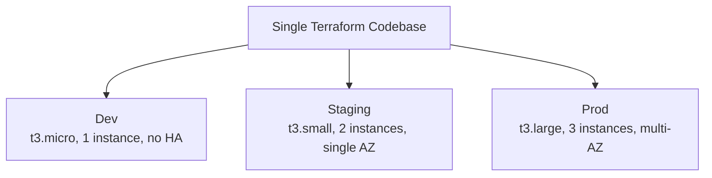
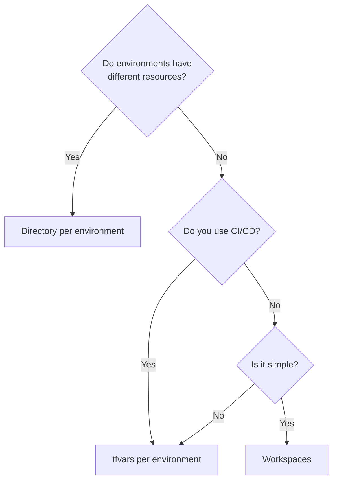
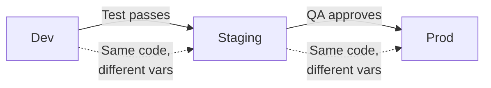

## The Problem

You need the same infrastructure in multiple environments (dev, staging, prod) with different configurations. How do you avoid duplicating your entire Terraform codebase?



---

## Approach 1: Workspaces

Terraform workspaces maintain separate state files for the same configuration:

```bash
# Create workspaces
terraform workspace new dev
terraform workspace new staging
terraform workspace new prod

# Switch workspace
terraform workspace select prod

# List workspaces
terraform workspace list
#   default
#   dev
#   staging
# * prod

# Show current
terraform workspace show
# prod
```

### Using Workspace in Configuration

```hcl
locals {
  env_config = {
    dev = {
      instance_type = "t3.micro"
      count         = 1
      multi_az      = false
    }
    staging = {
      instance_type = "t3.small"
      count         = 2
      multi_az      = false
    }
    prod = {
      instance_type = "t3.large"
      count         = 3
      multi_az      = true
    }
  }
  
  config = local.env_config[terraform.workspace]
}

resource "aws_instance" "web" {
  count         = local.config.count
  instance_type = local.config.instance_type
}
```

### Workspace State Storage

With S3 backend, workspaces create separate state paths:

```text
s3://terraform-state/
├── env:/dev/terraform.tfstate
├── env:/staging/terraform.tfstate
└── env:/prod/terraform.tfstate
```

### Workspace Limitations

| Issue | Problem |
|-------|---------|
| Same config for all envs | Can't have different resources per environment |
| Easy to forget which workspace | `terraform apply` in wrong workspace = disaster |
| No visual separation | All code in one directory |
| Shared provider config | Same AWS account unless you add logic |
| No partial differences | Can't add a resource only in prod |

---

## Approach 2: tfvars Per Environment (Recommended)

Same code, different variable files:

```text
project/
├── main.tf
├── variables.tf
├── outputs.tf
├── locals.tf
├── config/
│   ├── backend/
│   │   ├── dev.tfbackend
│   │   ├── staging.tfbackend
│   │   └── prod.tfbackend
│   └── variables/
│       ├── dev.tfvars
│       ├── staging.tfvars
│       └── prod.tfvars
```

```hcl
# config/variables/dev.tfvars
environment    = "dev"
instance_type  = "t3.micro"
instance_count = 1
multi_az       = false

# config/variables/prod.tfvars
environment    = "prod"
instance_type  = "t3.large"
instance_count = 3
multi_az       = true
```

```hcl
# config/backend/dev.tfbackend
key = "projects/myapp/dev/terraform.tfstate"

# config/backend/prod.tfbackend
key = "projects/myapp/prod/terraform.tfstate"
```

### Usage

```bash
# Initialize with environment-specific backend
terraform init -backend-config=config/backend/dev.tfbackend

# Plan with environment-specific variables
terraform plan -var-file=config/variables/dev.tfvars

# Apply
terraform apply -var-file=config/variables/prod.tfvars
```

### Advantages

- Explicit — you always know which environment you're targeting
- Separate state per environment (via backend config)
- Same code, different values
- Works naturally with CI/CD (pass env as parameter)

---

## Approach 3: Directory Per Environment

Separate directories, shared modules:

```text
infrastructure/
├── modules/
│   ├── vpc/
│   ├── ecs/
│   └── rds/
└── environments/
    ├── dev/
    │   ├── main.tf
    │   ├── variables.tf
    │   ├── outputs.tf
    │   └── terraform.tfvars
    ├── staging/
    │   ├── main.tf
    │   └── ...
    └── prod/
        ├── main.tf
        └── ...
```

```hcl
# environments/prod/main.tf
module "vpc" {
  source      = "../../modules/vpc"
  cidr_block  = "10.0.0.0/16"
  environment = "prod"
  az_count    = 3
}

module "database" {
  source         = "../../modules/rds"
  vpc_id         = module.vpc.vpc_id
  subnet_ids     = module.vpc.private_subnet_ids
  instance_class = "db.r6g.large"
  multi_az       = true  # only in prod
}
```

### Advantages

- Maximum flexibility — each environment can differ structurally
- Clear separation — impossible to accidentally apply to wrong env
- Independent state — each directory has its own state
- Prod can have resources that dev doesn't

### Disadvantages

- Code duplication in `main.tf` across environments
- Changes must be applied to each directory separately
- More files to maintain

---

## Comparison

| Approach | Flexibility | Safety | Duplication | Best For |
|----------|-------------|--------|-------------|----------|
| **Workspaces** | Low | Low | None | Simple setups, identical envs |
| **tfvars** | Medium | High | None | Most teams, CI/CD pipelines |
| **Directories** | High | Highest | Some | Complex infra, divergent envs |



---

## Environment Promotion Pattern



With tfvars approach in CI/CD:

```yaml
# Simplified CI/CD pipeline
stages:
  - plan
  - apply-dev
  - apply-staging
  - apply-prod

plan-dev:
  script: terraform plan -var-file=config/variables/dev.tfvars

apply-dev:
  script: terraform apply -var-file=config/variables/dev.tfvars -auto-approve
  only: [main]

apply-prod:
  script: terraform apply -var-file=config/variables/prod.tfvars -auto-approve
  only: [main]
  when: manual  # require human approval for prod
```

---

## Multi-Account Strategy

Production environments should be in separate AWS accounts:

```hcl
# Different provider configs per environment
provider "aws" {
  region = var.aws_region
  
  assume_role {
    role_arn = "arn:aws:iam::${var.account_id}:role/TerraformDeployRole"
  }
}
```

```hcl
# config/variables/dev.tfvars
account_id = "111111111111"
environment = "dev"

# config/variables/prod.tfvars
account_id = "999999999999"
environment = "prod"
```

---

## Key Takeaways

1. **Prefer tfvars over workspaces** — explicit, safe, CI/CD-friendly
2. **Use directories when environments diverge** — prod has resources dev doesn't
3. **Workspaces only for simple cases** — identical environments, solo developers
4. **Separate state per environment** — always, regardless of approach
5. **Separate AWS accounts per environment** — blast radius isolation
6. **CI/CD drives promotion** — same code flows dev → staging → prod
7. **Manual approval for production** — never auto-apply to prod without human review
