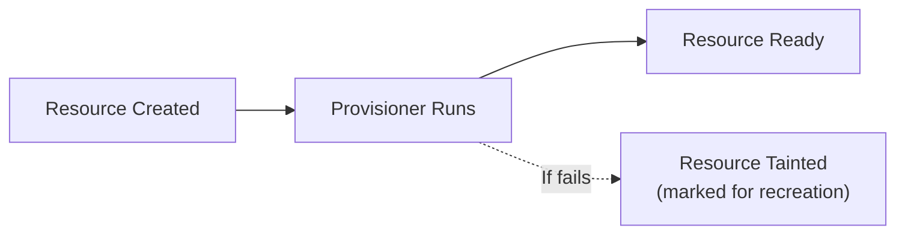

## What Are Provisioners?

Provisioners execute scripts or commands on resources after creation. They're Terraform's escape hatch for tasks that can't be expressed declaratively.



**Important:** Provisioners are a last resort. HashiCorp explicitly recommends avoiding them when possible because they break Terraform's declarative model.

---

## Types of Provisioners

### remote-exec

Runs commands on the remote resource via SSH or WinRM:

```hcl
resource "aws_instance" "web" {
  ami           = data.aws_ami.ubuntu.id
  instance_type = "t3.micro"
  key_name      = aws_key_pair.deploy.key_name

  provisioner "remote-exec" {
    inline = [
      "sudo apt-get update",
      "sudo apt-get install -y nginx",
      "sudo systemctl enable nginx",
    ]

    connection {
      type        = "ssh"
      user        = "ubuntu"
      private_key = file("~/.ssh/deploy_key")
      host        = self.public_ip
    }
  }
}
```

### local-exec

Runs commands on the machine running Terraform:

```hcl
resource "aws_instance" "web" {
  ami           = data.aws_ami.latest.id
  instance_type = "t3.micro"

  provisioner "local-exec" {
    command = "echo '${self.private_ip} web-server' >> inventory.txt"
  }
}

# With environment variables and working directory
resource "null_resource" "ansible" {
  provisioner "local-exec" {
    command     = "ansible-playbook -i inventory.txt playbook.yml"
    working_dir = "${path.module}/ansible"
    
    environment = {
      ANSIBLE_HOST_KEY_CHECKING = "false"
    }
  }
}
```

### file

Copies files or directories to the remote resource:

```hcl
resource "aws_instance" "web" {
  ami           = data.aws_ami.ubuntu.id
  instance_type = "t3.micro"

  provisioner "file" {
    source      = "config/nginx.conf"
    destination = "/tmp/nginx.conf"

    connection {
      type        = "ssh"
      user        = "ubuntu"
      private_key = file("~/.ssh/deploy_key")
      host        = self.public_ip
    }
  }

  provisioner "remote-exec" {
    inline = ["sudo mv /tmp/nginx.conf /etc/nginx/nginx.conf"]
    
    connection {
      type        = "ssh"
      user        = "ubuntu"
      private_key = file("~/.ssh/deploy_key")
      host        = self.public_ip
    }
  }
}
```

---

## Provisioner Behavior

### Creation-Time (Default)

Runs only when the resource is first created:

```hcl
provisioner "local-exec" {
  command = "echo 'Resource created at ${timestamp()}'"
}
```

### Destroy-Time

Runs before the resource is destroyed:

```hcl
provisioner "local-exec" {
  when    = destroy
  command = "echo 'Deregistering ${self.private_ip} from load balancer'"
}
```

### Failure Behavior

```hcl
provisioner "remote-exec" {
  on_failure = continue  # don't taint the resource if provisioner fails
  # on_failure = fail    # default: taint resource, recreate on next apply
  
  inline = ["some-optional-command"]
}
```

---

## Why to Avoid Provisioners

| Problem | Explanation |
|---------|-------------|
| **Not declarative** | Terraform can't plan or preview provisioner actions |
| **Not idempotent** | Running twice may break things |
| **Fragile** | SSH connectivity, timing issues, network problems |
| **Not in state** | Terraform doesn't track what provisioners did |
| **Hard to test** | Can't validate without actually running |
| **Slow** | Waiting for SSH, running scripts sequentially |

---

## Better Alternatives

### Instead of remote-exec: Use user_data

```hcl
resource "aws_instance" "web" {
  ami           = data.aws_ami.ubuntu.id
  instance_type = "t3.micro"

  # Cloud-init runs on first boot — no SSH needed
  user_data = <<-EOF
    #!/bin/bash
    apt-get update
    apt-get install -y nginx
    systemctl enable nginx
    systemctl start nginx
  EOF
}
```

### Instead of remote-exec: Use a pre-built AMI

```hcl
# Build AMI with Packer (includes all software)
data "aws_ami" "web" {
  most_recent = true
  owners      = ["self"]
  filter {
    name   = "name"
    values = ["web-server-*"]
  }
}

# Launch pre-configured AMI — no provisioning needed
resource "aws_instance" "web" {
  ami           = data.aws_ami.web.id
  instance_type = "t3.micro"
}
```

### Instead of local-exec for Ansible: Use null_resource with triggers

```hcl
resource "null_resource" "configure" {
  triggers = {
    instance_ids = join(",", aws_instance.web[*].id)
    config_hash  = filemd5("ansible/playbook.yml")
  }

  provisioner "local-exec" {
    command = "ansible-playbook -i '${join(",", aws_instance.web[*].private_ip)},' playbook.yml"
    working_dir = "${path.module}/ansible"
  }

  depends_on = [aws_instance.web]
}
```

### Instead of local-exec for API calls: Use provider resources

```hcl
# Bad: calling API with curl
provisioner "local-exec" {
  command = "curl -X POST https://api.datadog.com/monitors -d '...'"
}

# Good: use the Datadog provider
resource "datadog_monitor" "cpu" {
  name    = "High CPU"
  type    = "metric alert"
  query   = "avg(last_5m):avg:system.cpu.user{*} > 80"
  message = "CPU is high!"
}
```

---

## When Provisioners ARE Acceptable

| Scenario | Why |
|----------|-----|
| Bootstrapping a config management tool | One-time Ansible/Chef bootstrap on new instances |
| Registering with external system that has no provider | No Terraform provider exists |
| Running database migrations | After RDS creation, run schema migrations |
| Triggering external CI/CD | Notify a pipeline after infrastructure is ready |

Even in these cases, prefer `local-exec` over `remote-exec` — it's more reliable (no SSH dependency).

---

## null_resource Pattern

`null_resource` is a resource that does nothing — it exists solely to run provisioners:

```hcl
resource "null_resource" "db_migration" {
  triggers = {
    # Re-run when migration files change
    migration_hash = filemd5("migrations/latest.sql")
    db_endpoint    = aws_db_instance.main.endpoint
  }

  provisioner "local-exec" {
    command = "psql -h ${aws_db_instance.main.address} -U admin -f migrations/latest.sql"
    
    environment = {
      PGPASSWORD = var.db_password
    }
  }

  depends_on = [aws_db_instance.main]
}
```

In Terraform 1.7+, prefer `terraform_data` over `null_resource`:

```hcl
resource "terraform_data" "db_migration" {
  triggers_replace = [filemd5("migrations/latest.sql")]

  provisioner "local-exec" {
    command = "psql -h ${aws_db_instance.main.address} -f migrations/latest.sql"
  }
}
```

---

## Key Takeaways

1. **Provisioners are a last resort** — they break the declarative model
2. **Prefer user_data** — cloud-init is native, reliable, and doesn't need SSH
3. **Prefer pre-built AMIs** — Packer builds immutable images with everything installed
4. **Prefer provider resources** — if a Terraform provider exists, use it
5. **Use `local-exec` over `remote-exec`** — no SSH dependency, more reliable
6. **Use `terraform_data` for triggers** — replaces `null_resource` in modern Terraform
7. **Set `on_failure = continue`** — when the provisioner is optional and shouldn't taint the resource
