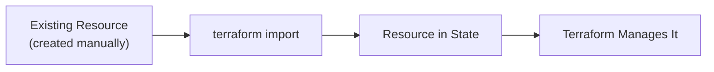
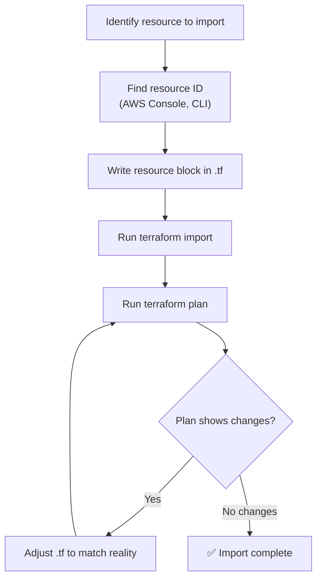
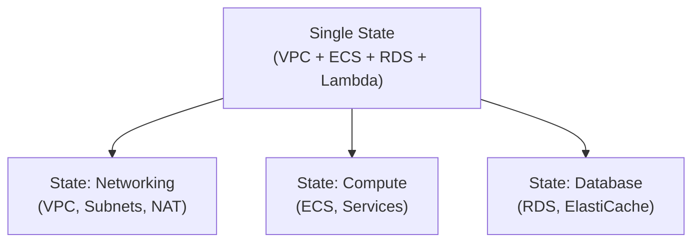

## Why Manipulate State?

As infrastructure evolves, you need to:

- **Import** existing resources into Terraform management
- **Rename** resources without destroying them
- **Move** resources into or out of modules
- **Remove** resources from Terraform without destroying them
- **Split** large state files into smaller ones

All of these require state manipulation — changing what Terraform knows without changing the actual infrastructure.

---

## Importing Existing Resources

### The Problem

You have infrastructure created manually (or by another tool) that you now want Terraform to manage.



### CLI Import

```bash
# Syntax: terraform import <resource_address> <resource_id>
terraform import aws_instance.web i-0abc123def456
terraform import aws_s3_bucket.data my-data-bucket
terraform import aws_vpc.main vpc-0abc123
terraform import 'aws_security_group.web' sg-0abc123

# Import into indexed resources
terraform import 'aws_subnet.public[0]' subnet-aaa
terraform import 'aws_subnet.public[1]' subnet-bbb

# Import into for_each resources
terraform import 'aws_iam_user.team["alice"]' alice
```

After importing, you must write the corresponding configuration — import only adds to state, it doesn't generate `.tf` files (unless using import blocks).

### Import Blocks (Terraform 1.5+)

Declarative import that can also generate configuration:

```hcl
# import.tf
import {
  to = aws_instance.web
  id = "i-0abc123def456"
}

import {
  to = aws_s3_bucket.data
  id = "my-data-bucket"
}
```

```bash
# Generate configuration from imported resources
terraform plan -generate-config-out=generated.tf

# Review generated.tf, clean it up, then:
terraform apply
```

The generated config is a starting point — you'll need to clean it up (remove computed attributes, add variables, etc.).

### Import Workflow



---

## Renaming Resources

### The Problem

You want to rename `aws_instance.web` to `aws_instance.api_server`. Without state manipulation, Terraform sees this as "destroy web, create api_server."

### moved Block (Terraform 1.1+, Preferred)

```hcl
# Add this to your configuration
moved {
  from = aws_instance.web
  to   = aws_instance.api_server
}
```

On next `terraform apply`, Terraform updates state without destroying anything. After applying, you can remove the `moved` block (it's only needed once).

### State mv Command

```bash
terraform state mv aws_instance.web aws_instance.api_server
```

Same effect, but imperative. Prefer `moved` blocks — they're declarative, reviewable in MRs, and work in CI/CD.

---

## Moving Resources Into/Out of Modules

### Into a Module

```hcl
# Before: resource at root level
# resource "aws_vpc" "main" { ... }

# After: resource inside module
# module "networking" { source = "./modules/networking" }

moved {
  from = aws_vpc.main
  to   = module.networking.aws_vpc.main
}
```

### Out of a Module

```hcl
moved {
  from = module.networking.aws_vpc.main
  to   = aws_vpc.main
}
```

### Between Modules

```hcl
moved {
  from = module.old_module.aws_instance.web
  to   = module.new_module.aws_instance.web
}
```

---

## Removing Resources from State

### terraform state rm

Terraform "forgets" the resource — it still exists in the cloud, but Terraform no longer manages it:

```bash
# Remove a single resource
terraform state rm aws_instance.legacy

# Remove an entire module
terraform state rm module.old_service

# Remove indexed resource
terraform state rm 'aws_subnet.public[2]'
```

### removed Block (Terraform 1.7+)

```hcl
removed {
  from = aws_instance.legacy
  
  lifecycle {
    destroy = false  # don't destroy the real resource
  }
}
```

Use cases:

- Handing off a resource to another team's Terraform
- Resource will be managed by a different tool
- Decommissioning Terraform management without destroying infrastructure

---

## Splitting State

When a state file grows too large, split it into separate configurations:



### Process

```bash
# 1. Move resources to new state
terraform state mv -state-out=networking.tfstate aws_vpc.main aws_vpc.main
terraform state mv -state-out=networking.tfstate aws_subnet.public aws_subnet.public

# 2. Create new Terraform project for networking
# 3. Initialize with the extracted state
# 4. Use terraform_remote_state to share outputs between projects
```

### Cross-State References

```hcl
# In the compute project: read networking outputs
data "terraform_remote_state" "networking" {
  backend = "s3"
  config = {
    bucket = "terraform-state"
    key    = "networking/terraform.tfstate"
    region = "eu-central-1"
  }
}

resource "aws_ecs_service" "api" {
  network_configuration {
    subnets = data.terraform_remote_state.networking.outputs.private_subnet_ids
  }
}
```

---

## Refactoring Patterns

### count to for_each Migration

```hcl
# Before: count-based
# resource "aws_subnet" "public" {
#   count = 3
#   ...
# }

# After: for_each-based
resource "aws_subnet" "public" {
  for_each = toset(["a", "b", "c"])
  # ...
}

# Move state entries
moved {
  from = aws_subnet.public[0]
  to   = aws_subnet.public["a"]
}
moved {
  from = aws_subnet.public[1]
  to   = aws_subnet.public["b"]
}
moved {
  from = aws_subnet.public[2]
  to   = aws_subnet.public["c"]
}
```

### Renaming Module Instances

```hcl
# Before: module "web_service" { ... }
# After:  module "api_service" { ... }

moved {
  from = module.web_service
  to   = module.api_service
}
```

---

## State Inspection

```bash
# List everything in state
terraform state list
# aws_vpc.main
# aws_subnet.public[0]
# aws_subnet.public[1]
# module.ecs.aws_ecs_cluster.main

# Show resource details
terraform state show aws_vpc.main
# resource "aws_vpc" "main" {
#     arn                  = "arn:aws:ec2:eu-central-1:123456789:vpc/vpc-abc"
#     cidr_block           = "10.0.0.0/16"
#     id                   = "vpc-abc"
#     ...
# }

# Pull entire state as JSON (for debugging)
terraform state pull | jq '.resources | length'
# 47
```

---

## Safety Rules

1. **Always backup state before manipulation**

   ```bash
   terraform state pull > backup-$(date +%Y%m%d).tfstate
   ```

2. **Run `terraform plan` after any state operation** — verify no unexpected changes

3. **Use `moved` blocks over `state mv`** — they're reviewable, reversible, and work in CI/CD

4. **Never edit state JSON manually** — use `terraform state` commands

5. **Test in dev first** — practice state operations on non-production environments

---

## Key Takeaways

1. **Import brings existing resources under Terraform management** — use import blocks for declarative workflow
2. **`moved` blocks are the modern way to refactor** — rename, restructure, modularize without destroying
3. **`state rm` makes Terraform forget** — resource continues to exist, just unmanaged
4. **Split large states** — separate concerns for speed, safety, and team ownership
5. **Always plan after state changes** — verify the operation did what you expected
6. **Backup before manipulating** — state corruption is hard to recover from
