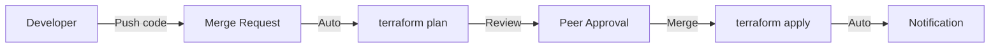
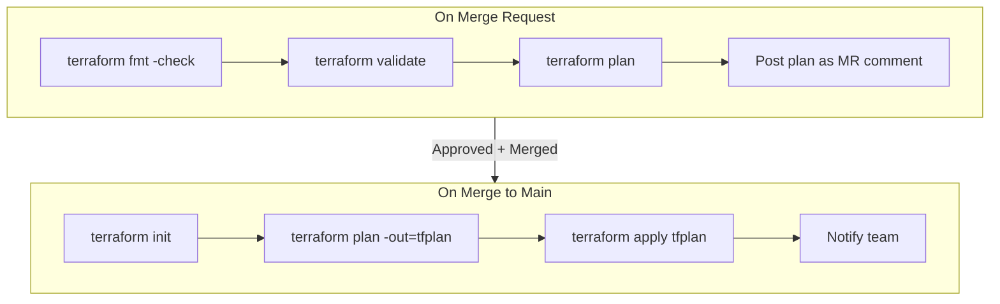
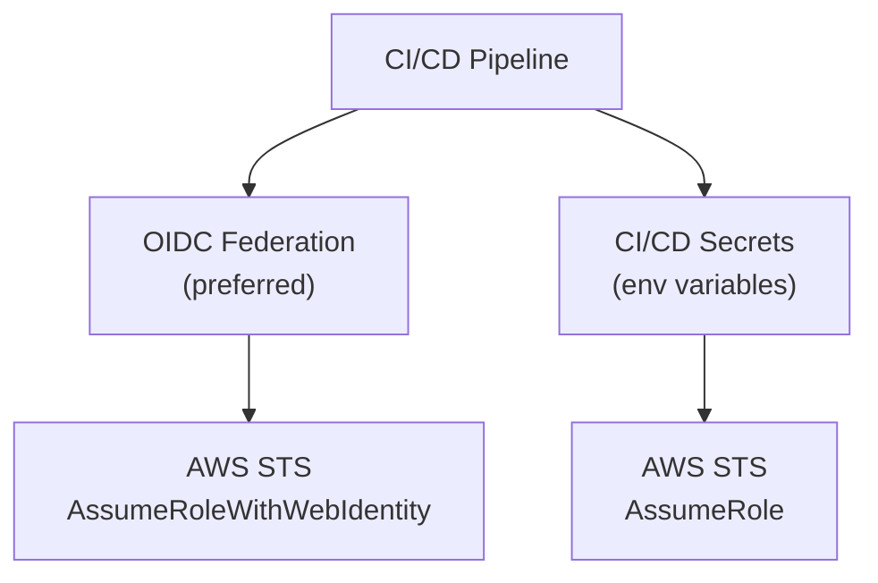
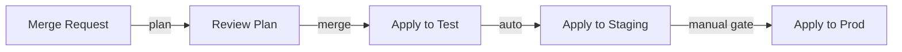

## Why Automate Terraform?

Running Terraform manually introduces risk:

- Wrong environment targeted
- Unapproved changes applied
- No audit trail
- State corruption from concurrent runs
- Inconsistent workflows between team members

CI/CD pipelines enforce a consistent, safe, auditable workflow.



---

## The Standard Workflow



### Key Principles

1. **Plan on MR** — everyone sees what will change before it happens
2. **Apply on merge** — only approved changes reach infrastructure
3. **Save plan artifact** — what was reviewed is exactly what gets applied
4. **Never auto-approve production** — require manual gate for prod

---

## GitLab CI Example

```yaml
# .gitlab-ci.yml
include:
  - project: dx/cloud/ci-cd/terraform/terraform-project-pipeline
    ref: v2.6.2
    file: terraform-pipeline.gitlab-ci.yml

variables:
  TERRAFORM_IMAGE_VERSION: "1.11.4"
  ENABLE_TEST_ENV: "true"
  ENABLE_PRE_ENV: "true"
  ENABLE_PROD_ENV: "true"
  AWS_DEPLOY_ACCOUNT_ALIAS: "TUIDS"

stages:
  - lint
  - plan
  - apply
```

### Custom Pipeline (Without Shared Template)

```yaml
stages:
  - validate
  - plan
  - apply

variables:
  TF_ROOT: "states/main"

.terraform-base:
  image: hashicorp/terraform:1.11.4
  before_script:
    - cd $TF_ROOT
    - terraform init -backend-config=../../config/backend/${ENVIRONMENT}.tfbackend

validate:
  extends: .terraform-base
  stage: validate
  variables:
    ENVIRONMENT: test
  script:
    - terraform fmt -check -recursive
    - terraform validate
  rules:
    - if: $CI_MERGE_REQUEST_IID

plan:test:
  extends: .terraform-base
  stage: plan
  variables:
    ENVIRONMENT: test
  script:
    - terraform plan -var-file=../../config/variables/test.tfvars -out=tfplan
  artifacts:
    paths: [states/main/tfplan]
    expire_in: 1 day
  rules:
    - if: $CI_MERGE_REQUEST_IID

plan:prod:
  extends: .terraform-base
  stage: plan
  variables:
    ENVIRONMENT: prod
  script:
    - terraform plan -var-file=../../config/variables/prod.tfvars -out=tfplan
  artifacts:
    paths: [states/main/tfplan]
    expire_in: 1 day
  rules:
    - if: $CI_COMMIT_BRANCH == "main"

apply:test:
  extends: .terraform-base
  stage: apply
  variables:
    ENVIRONMENT: test
  script:
    - terraform apply tfplan
  dependencies: [plan:test]
  rules:
    - if: $CI_COMMIT_BRANCH == "main"

apply:prod:
  extends: .terraform-base
  stage: apply
  variables:
    ENVIRONMENT: prod
  script:
    - terraform apply tfplan
  dependencies: [plan:prod]
  when: manual  # require human click
  rules:
    - if: $CI_COMMIT_BRANCH == "main"
```

---

## GitHub Actions Example

```yaml
name: Terraform
on:
  pull_request:
    branches: [main]
  push:
    branches: [main]

jobs:
  plan:
    runs-on: ubuntu-latest
    if: github.event_name == 'pull_request'
    steps:
      - uses: actions/checkout@v4
      - uses: hashicorp/setup-terraform@v3
        with:
          terraform_version: 1.11.4
      
      - run: terraform init
      - run: terraform fmt -check
      - run: terraform validate
      - run: terraform plan -no-color -out=tfplan
      
      - uses: actions/upload-artifact@v4
        with:
          name: tfplan
          path: tfplan

  apply:
    runs-on: ubuntu-latest
    if: github.ref == 'refs/heads/main' && github.event_name == 'push'
    environment: production  # requires approval
    steps:
      - uses: actions/checkout@v4
      - uses: hashicorp/setup-terraform@v3
      - run: terraform init
      - run: terraform apply -auto-approve
```

---

## Plan Artifacts

The plan file captures the exact changes that were reviewed:

```bash
# Generate plan file
terraform plan -out=tfplan

# Apply the exact plan (not re-planning)
terraform apply tfplan
```

Why this matters:

- Between plan and apply, infrastructure could change
- Without a saved plan, `apply` re-plans and might do something different
- The plan artifact ensures what was reviewed = what gets applied

---

## Security in CI/CD

### Credential Management



**Best practice:** Use OIDC federation — no long-lived credentials:

```yaml
# GitLab CI with OIDC
assume-role:
  id_tokens:
    GITLAB_OIDC_TOKEN:
      aud: https://gitlab.com
  script:
    - >
      export $(aws sts assume-role-with-web-identity
      --role-arn $ROLE_ARN
      --web-identity-token $GITLAB_OIDC_TOKEN
      --role-session-name "gitlab-ci-${CI_PIPELINE_ID}"
      --query 'Credentials.[AccessKeyId,SecretAccessKey,SessionToken]'
      --output text | xargs -n3 printf 'AWS_ACCESS_KEY_ID=%s AWS_SECRET_ACCESS_KEY=%s AWS_SESSION_TOKEN=%s')
```

### Least Privilege

The CI/CD role should only have permissions needed for the resources it manages:

```json
{
  "Version": "2012-10-17",
  "Statement": [
    {
      "Effect": "Allow",
      "Action": [
        "ec2:*",
        "ecs:*",
        "rds:*",
        "s3:*"
      ],
      "Resource": "*",
      "Condition": {
        "StringEquals": {
          "aws:RequestedRegion": "eu-central-1"
        }
      }
    },
    {
      "Effect": "Allow",
      "Action": ["s3:GetObject", "s3:PutObject"],
      "Resource": "arn:aws:s3:::terraform-state/*"
    },
    {
      "Effect": "Allow",
      "Action": ["dynamodb:GetItem", "dynamodb:PutItem", "dynamodb:DeleteItem"],
      "Resource": "arn:aws:dynamodb:*:*:table/terraform-locks"
    }
  ]
}
```

---

## Automated Checks

### Pre-Plan Checks

| Tool | Purpose |
|------|---------|
| `terraform fmt -check` | Code formatting |
| `terraform validate` | Syntax and type validation |
| `tflint` | Linting (deprecated resources, naming) |
| `checkov` / `tfsec` | Security scanning |
| `infracost` | Cost estimation |

### Post-Plan Checks

| Check | Purpose |
|-------|---------|
| Plan has no errors | Basic sanity |
| No unexpected destroys | Safety gate |
| Cost delta within budget | Financial control |
| No security violations | Compliance |

---

## Environment Promotion



```yaml
# Progressive deployment
apply:test:
  stage: deploy
  script: terraform apply -var-file=config/variables/test.tfvars -auto-approve
  rules:
    - if: $CI_COMMIT_BRANCH == "main"

apply:staging:
  stage: deploy
  script: terraform apply -var-file=config/variables/staging.tfvars -auto-approve
  needs: [apply:test]
  rules:
    - if: $CI_COMMIT_BRANCH == "main"

apply:prod:
  stage: deploy
  script: terraform apply -var-file=config/variables/prod.tfvars -auto-approve
  needs: [apply:staging]
  when: manual
  rules:
    - if: $CI_COMMIT_BRANCH == "main"
```

---

## Key Takeaways

1. **Never apply manually in production** — CI/CD enforces review, approval, and audit
2. **Plan on MR, apply on merge** — everyone sees changes before they happen
3. **Save plan artifacts** — ensures reviewed plan = applied plan
4. **Use OIDC over static credentials** — no long-lived secrets in CI/CD
5. **Gate production with manual approval** — human must click to deploy to prod
6. **Add security scanning** — tfsec/checkov catch misconfigurations before apply
7. **Progressive promotion** — test → staging → prod with gates between each
