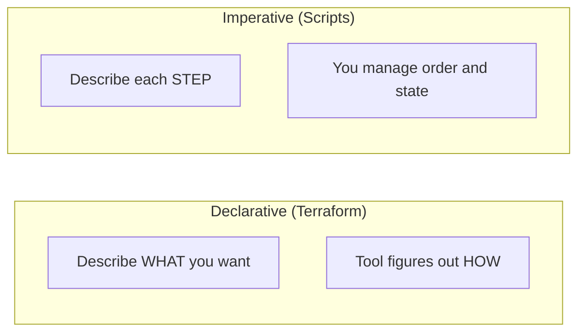
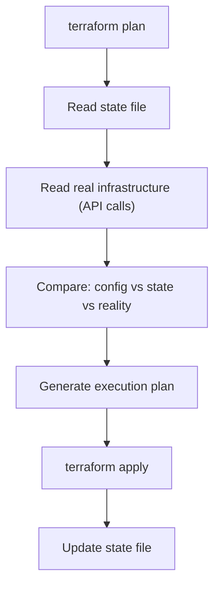
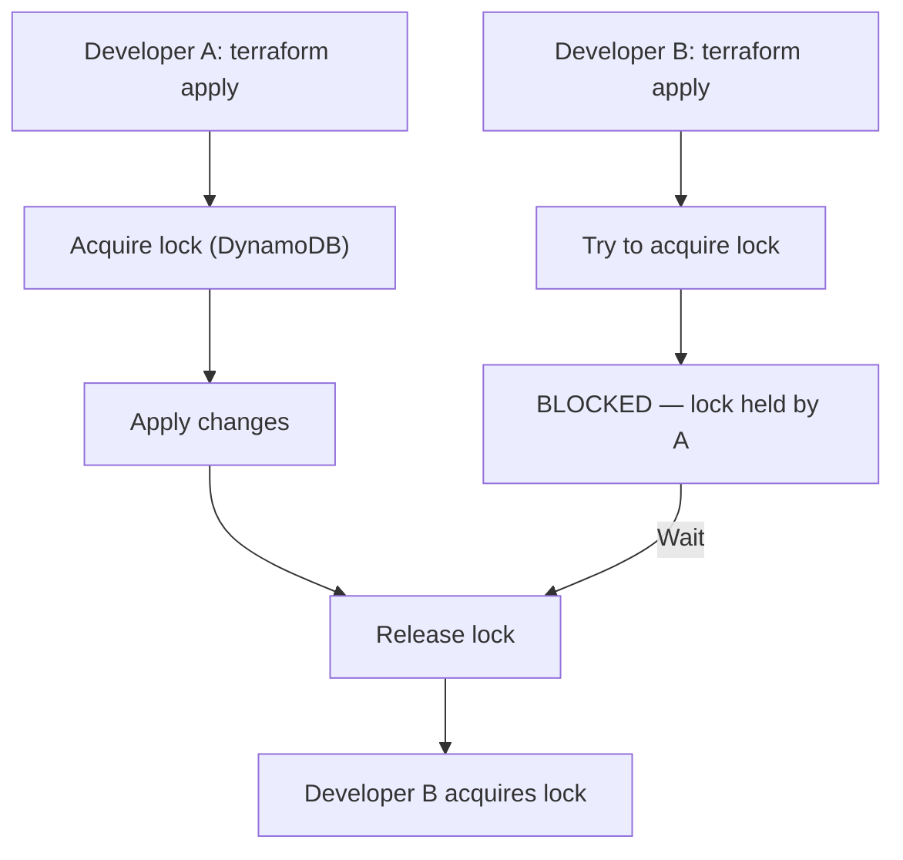
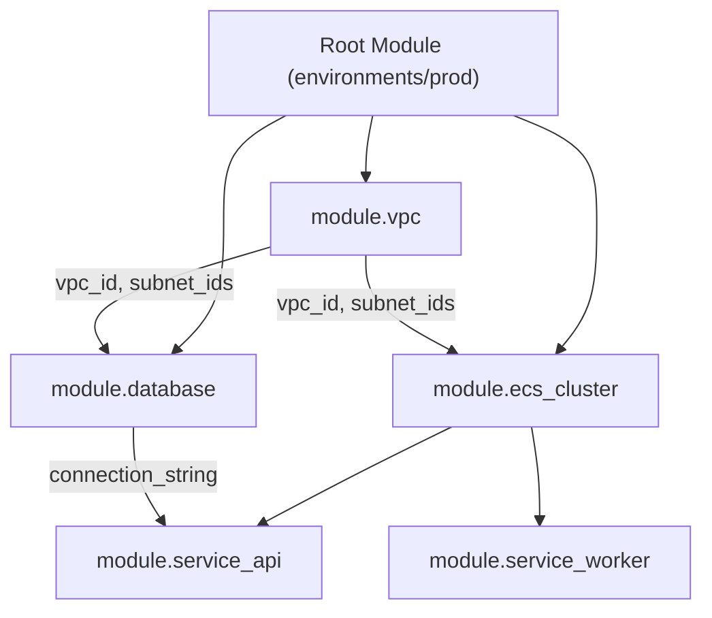
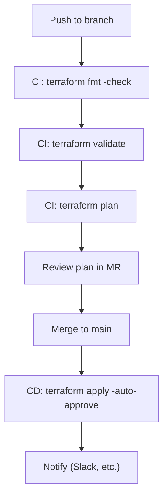

Terraform is an Infrastructure as Code (IaC) tool by HashiCorp that lets you define, provision, and manage cloud infrastructure using declarative configuration files. You describe the desired state; Terraform figures out how to get there.

## Prerequisites

- Basic cloud concepts (VMs, networks, storage)
- Command-line familiarity
- Understanding of version control (Git)

---

## 1. Infrastructure as Code Concepts

### Why IaC?

| Manual Infrastructure | Infrastructure as Code |
|----------------------|----------------------|
| Click through console | Write configuration files |
| Undocumented changes | Version-controlled history |
| Hard to reproduce | Repeatable deployments |
| Drift goes unnoticed | Drift detection built-in |
| Slow to scale | Automated provisioning |

### Declarative vs Imperative



**Declarative (Terraform):** "I want 3 EC2 instances behind a load balancer."
**Imperative (Bash/SDK):** "Create instance 1. Create instance 2. Create instance 3. Create ALB. Register targets."

### Why Terraform Specifically?

| Feature | Terraform | CloudFormation | Pulumi |
|---------|-----------|----------------|--------|
| Multi-cloud | Yes | AWS only | Yes |
| Language | HCL (declarative) | JSON/YAML | General-purpose (TS, Python) |
| State | Explicit (file/remote) | Managed by AWS | Managed by Pulumi |
| Ecosystem | Huge provider library | AWS-native | Growing |
| Plan/Preview | `terraform plan` | Change sets | `pulumi preview` |

### Key Takeaway

IaC treats infrastructure like software — versioned, reviewed, tested, and automated. Terraform's declarative model and multi-cloud support make it the industry standard.

---

## 2. HCL Syntax

HCL (HashiCorp Configuration Language) is Terraform's domain-specific language.

### Blocks

```hcl
# Block type "label1" "label2" { ... }
resource "aws_instance" "web" {
  ami           = "ami-0c55b159cbfafe1f0"
  instance_type = "t3.micro"
  
  tags = {
    Name = "web-server"
  }
}
```

### Attributes and Expressions

```hcl
# String interpolation
name = "app-${var.environment}-${var.region}"

# Conditional
instance_type = var.environment == "prod" ? "t3.large" : "t3.micro"

# For expressions
upper_names = [for name in var.names : upper(name)]
name_map    = { for name in var.names : name => upper(name) }

# Splat
instance_ids = aws_instance.web[*].id

# Dynamic blocks
dynamic "ingress" {
  for_each = var.ingress_rules
  content {
    from_port   = ingress.value.from_port
    to_port     = ingress.value.to_port
    protocol    = ingress.value.protocol
    cidr_blocks = ingress.value.cidr_blocks
  }
}
```

### Types

```hcl
# Primitive
string  = "hello"
number  = 42
bool    = true

# Complex
list    = ["a", "b", "c"]
map     = { key1 = "value1", key2 = "value2" }
set     = toset(["a", "b", "c"])

# Structural
object({
  name = string
  age  = number
  tags = map(string)
})

tuple([string, number, bool])
```

### Key Takeaway

HCL is designed to be human-readable and machine-parseable. It's not a general-purpose language — it's purpose-built for infrastructure configuration.

---

## 3. Providers, Resources, and Data Sources

### Providers

Providers are plugins that interact with APIs (AWS, Azure, GCP, Kubernetes, etc.):

```hcl
terraform {
  required_providers {
    aws = {
      source  = "hashicorp/aws"
      version = "~> 5.0"
    }
  }
}

provider "aws" {
  region = "eu-central-1"
  
  default_tags {
    tags = {
      Environment = var.environment
      ManagedBy   = "terraform"
    }
  }
}
```

### Resources

Resources are the infrastructure objects Terraform manages:

```hcl
resource "aws_vpc" "main" {
  cidr_block           = "10.0.0.0/16"
  enable_dns_hostnames = true
  
  tags = {
    Name = "main-vpc"
  }
}

resource "aws_subnet" "public" {
  count             = 3
  vpc_id            = aws_vpc.main.id
  cidr_block        = cidrsubnet(aws_vpc.main.cidr_block, 8, count.index)
  availability_zone = data.aws_availability_zones.available.names[count.index]
  
  map_public_ip_on_launch = true
}
```

### Data Sources

Read existing infrastructure (not managed by this Terraform):

```hcl
# Look up existing resources
data "aws_ami" "amazon_linux" {
  most_recent = true
  owners      = ["amazon"]
  
  filter {
    name   = "name"
    values = ["amzn2-ami-hvm-*-x86_64-gp2"]
  }
}

data "aws_availability_zones" "available" {
  state = "available"
}

# Use in resources
resource "aws_instance" "web" {
  ami = data.aws_ami.amazon_linux.id
  # ...
}
```

### Key Takeaway

Providers connect Terraform to APIs. Resources create/manage infrastructure. Data sources read existing infrastructure. Together, they form the building blocks of every Terraform configuration.

---

## 4. State

State is Terraform's record of what infrastructure it manages. It maps configuration to real-world resources.

### How State Works



### State File

```json
{
  "version": 4,
  "terraform_version": "1.7.0",
  "resources": [
    {
      "type": "aws_instance",
      "name": "web",
      "instances": [
        {
          "attributes": {
            "id": "i-0abc123def456",
            "ami": "ami-0c55b159cbfafe1f0",
            "instance_type": "t3.micro"
          }
        }
      ]
    }
  ]
}
```

### Remote Backends

Never store state locally in production. Use a remote backend:

```hcl
terraform {
  backend "s3" {
    bucket         = "my-terraform-state"
    key            = "prod/terraform.tfstate"
    region         = "eu-central-1"
    encrypt        = true
    dynamodb_table = "terraform-locks"  # state locking
  }
}
```

### State Locking

Prevents concurrent modifications:



### Drift

Drift = real infrastructure differs from state. Causes:

- Manual changes in the console
- Another tool modified the resource
- External processes (auto-scaling, etc.)

Detection: `terraform plan` shows drift as changes to apply.

### Key Takeaway

State is Terraform's source of truth. Protect it (encrypt, remote backend), lock it (DynamoDB), and never edit it manually. Drift detection is automatic — run `plan` regularly.

---

## 5. Variables, Outputs, and Locals

### Input Variables

```hcl
variable "environment" {
  description = "Deployment environment"
  type        = string
  default     = "dev"
  
  validation {
    condition     = contains(["dev", "staging", "prod"], var.environment)
    error_message = "Environment must be dev, staging, or prod."
  }
}

variable "instance_config" {
  description = "EC2 instance configuration"
  type = object({
    instance_type = string
    volume_size   = number
    enable_monitoring = bool
  })
  default = {
    instance_type     = "t3.micro"
    volume_size       = 20
    enable_monitoring = false
  }
}
```

### Setting Variables

Priority (highest to lowest):

1. `-var` flag: `terraform apply -var="environment=prod"`
2. `.auto.tfvars` files (auto-loaded)
3. `terraform.tfvars` (auto-loaded)
4. Named `.tfvars`: `terraform apply -var-file="prod.tfvars"`
5. Environment variables: `TF_VAR_environment=prod`
6. Default value in variable block
7. Interactive prompt (if no default)

### Outputs

Expose values for other configurations or human consumption:

```hcl
output "vpc_id" {
  description = "ID of the created VPC"
  value       = aws_vpc.main.id
}

output "public_subnet_ids" {
  description = "IDs of public subnets"
  value       = aws_subnet.public[*].id
}

output "db_password" {
  description = "Database password"
  value       = random_password.db.result
  sensitive   = true  # hidden in CLI output
}
```

### Locals

Computed values for internal use — reduce repetition:

```hcl
locals {
  common_tags = {
    Environment = var.environment
    Project     = var.project_name
    ManagedBy   = "terraform"
  }
  
  name_prefix = "${var.project_name}-${var.environment}"
  
  is_production = var.environment == "prod"
}

resource "aws_instance" "web" {
  instance_type = local.is_production ? "t3.large" : "t3.micro"
  tags          = merge(local.common_tags, { Name = "${local.name_prefix}-web" })
}
```

### Key Takeaway

Variables make configurations reusable. Outputs expose values. Locals reduce repetition. Use `.tfvars` files per environment to keep the same code across dev/staging/prod.

---

## 6. Modules

Modules are reusable, composable units of Terraform configuration.

### Module Structure

```text
modules/
└── vpc/
    ├── main.tf          # Resources
    ├── variables.tf     # Input variables
    ├── outputs.tf       # Output values
    └── README.md        # Documentation
```

### Using a Module

```hcl
module "vpc" {
  source = "./modules/vpc"
  
  cidr_block    = "10.0.0.0/16"
  environment   = var.environment
  az_count      = 3
}

# Access module outputs
resource "aws_instance" "web" {
  subnet_id = module.vpc.public_subnet_ids[0]
}
```

### Module Sources

```hcl
# Local path
source = "./modules/vpc"

# Git repository
source = "git::https://github.com/org/terraform-modules.git//vpc?ref=v1.2.0"

# Terraform Registry
source  = "terraform-aws-modules/vpc/aws"
version = "~> 5.0"

# S3 bucket
source = "s3::https://s3-eu-central-1.amazonaws.com/my-bucket/vpc.zip"
```

### Module Composition



### Key Takeaway

Modules are Terraform's abstraction mechanism. Keep them focused (one concern per module), version them, and compose them to build complex infrastructure from simple building blocks.

---

## 7. Lifecycle Rules and Dependencies

### Implicit Dependencies

Terraform automatically detects dependencies from references:

```hcl
resource "aws_vpc" "main" {
  cidr_block = "10.0.0.0/16"
}

# Implicit dependency: Terraform knows this needs the VPC first
resource "aws_subnet" "public" {
  vpc_id     = aws_vpc.main.id  # ← reference creates dependency
  cidr_block = "10.0.1.0/24"
}
```

### Explicit Dependencies

When there's no reference but an ordering requirement:

```hcl
resource "aws_instance" "web" {
  ami           = data.aws_ami.latest.id
  instance_type = "t3.micro"
  
  depends_on = [aws_iam_role_policy.web_policy]
  # Policy must exist before instance, even though no direct reference
}
```

### Lifecycle Rules

```hcl
resource "aws_instance" "web" {
  ami           = data.aws_ami.latest.id
  instance_type = "t3.micro"
  
  lifecycle {
    # Don't destroy before creating replacement
    create_before_destroy = true
    
    # Ignore changes made outside Terraform
    ignore_changes = [tags, ami]
    
    # Prevent accidental destruction
    prevent_destroy = true
    
    # Replace when expression changes
    replace_triggered_by = [null_resource.trigger.id]
  }
}
```

### Resource Targeting

Apply only specific resources (use sparingly):

```bash
terraform plan -target=aws_instance.web
terraform apply -target=module.vpc
```

### Key Takeaway

Let Terraform manage dependencies implicitly through references. Use `depends_on` only when there's a hidden dependency. Lifecycle rules handle edge cases like zero-downtime replacements and drift tolerance.

---

## 8. Workspaces and Environment Management

### Workspaces

Workspaces maintain separate state files for the same configuration:

```bash
terraform workspace new staging
terraform workspace new production
terraform workspace select staging
terraform workspace list
```

```hcl
# Use workspace name in configuration
resource "aws_instance" "web" {
  instance_type = terraform.workspace == "production" ? "t3.large" : "t3.micro"
  
  tags = {
    Environment = terraform.workspace
  }
}
```

### Directory-Based Environments (Preferred)

```text
infrastructure/
├── modules/
│   ├── vpc/
│   ├── ecs/
│   └── rds/
├── environments/
│   ├── dev/
│   │   ├── main.tf
│   │   ├── variables.tf
│   │   └── terraform.tfvars
│   ├── staging/
│   │   ├── main.tf
│   │   ├── variables.tf
│   │   └── terraform.tfvars
│   └── prod/
│       ├── main.tf
│       ├── variables.tf
│       └── terraform.tfvars
```

### Workspaces vs Directories

| Approach | Pros | Cons |
|----------|------|------|
| Workspaces | Less code duplication | Same config for all envs, easy mistakes |
| Directories | Explicit per-env config, safer | Some duplication |
| tfvars files | Balance of both | Requires discipline |

### Key Takeaway

For production systems, prefer directory-based or tfvars-based environment separation over workspaces. Workspaces are fine for simple setups but don't scale well when environments diverge.

---

## 9. Provisioners

Provisioners execute scripts on resources after creation. **Use them as a last resort.**

```hcl
resource "aws_instance" "web" {
  ami           = data.aws_ami.latest.id
  instance_type = "t3.micro"
  
  # Runs on the remote machine after creation
  provisioner "remote-exec" {
    inline = [
      "sudo apt-get update",
      "sudo apt-get install -y nginx",
    ]
    
    connection {
      type        = "ssh"
      user        = "ubuntu"
      private_key = file("~/.ssh/id_rsa")
      host        = self.public_ip
    }
  }
  
  # Runs on the machine running Terraform
  provisioner "local-exec" {
    command = "echo ${self.public_ip} >> inventory.txt"
  }
}
```

### Why to Avoid Provisioners

| Problem | Better Alternative |
|---------|-------------------|
| Configuration management | Use Ansible, Chef, Puppet |
| Install software | Use AMIs (Packer), user_data |
| Run scripts | Use cloud-init, user_data |
| Trigger external systems | Use `null_resource` + `local-exec` sparingly |

### Key Takeaway

Provisioners break Terraform's declarative model — they're imperative, hard to test, and don't participate in the plan. Use cloud-native alternatives (user_data, AMIs, configuration management tools) instead.

---

## 10. Import, State Manipulation, and Refactoring

### Import Existing Resources

```bash
# Import a resource into state
terraform import aws_instance.web i-0abc123def456

# Import block (Terraform 1.5+) — generates config
import {
  to = aws_instance.web
  id = "i-0abc123def456"
}
```

### State Commands

```bash
# List resources in state
terraform state list

# Show a specific resource
terraform state show aws_instance.web

# Move/rename a resource (avoids destroy+recreate)
terraform state mv aws_instance.web aws_instance.api

# Remove from state (Terraform forgets it, doesn't destroy)
terraform state rm aws_instance.legacy

# Pull remote state locally
terraform state pull > state.json
```

### Refactoring with `moved` Blocks

```hcl
# Rename without destroy+recreate
moved {
  from = aws_instance.web
  to   = aws_instance.api_server
}

# Move into a module
moved {
  from = aws_instance.web
  to   = module.compute.aws_instance.main
}
```

### Key Takeaway

State manipulation is how you refactor Terraform without destroying infrastructure. Use `moved` blocks for renames, `import` for adopting existing resources, and `state rm` for removing resources from management.

---

## 11. CI/CD Integration

### Plan/Apply Workflow



### GitOps Pattern

```yaml
# .gitlab-ci.yml (simplified)
stages:
  - validate
  - plan
  - apply

validate:
  stage: validate
  script:
    - terraform init
    - terraform fmt -check
    - terraform validate

plan:
  stage: plan
  script:
    - terraform init
    - terraform plan -out=tfplan
  artifacts:
    paths: [tfplan]

apply:
  stage: apply
  script:
    - terraform apply tfplan
  when: manual  # require human approval
  only: [main]
```

### Key Takeaway

Never apply Terraform manually in production. Use CI/CD with plan review on MRs and controlled apply on merge. Store the plan artifact to ensure what was reviewed is what gets applied.

---

## 12. Best Practices

### Naming

```hcl
# Resources: descriptive, snake_case
resource "aws_security_group" "web_server_sg" { }
resource "aws_iam_role" "ecs_task_execution" { }

# Variables: descriptive, snake_case
variable "vpc_cidr_block" { }
variable "enable_monitoring" { }

# Outputs: descriptive, include resource type context
output "vpc_id" { }
output "public_subnet_ids" { }
```

### File Organization

```text
project/
├── main.tf              # Primary resources or module calls
├── variables.tf         # All input variables
├── outputs.tf           # All outputs
├── locals.tf            # Local values
├── data.tf              # Data sources
├── providers.tf         # Provider configuration
├── versions.tf          # Required providers and versions
└── terraform.tfvars     # Variable values (not committed for secrets)
```

### Security

- **Never commit secrets** — use variables, Secrets Manager, or Vault
- **Encrypt state** — always enable encryption on remote backends
- **Least privilege** — Terraform's IAM role should have only needed permissions
- **Pin provider versions** — avoid unexpected breaking changes
- **Use `sensitive = true`** — for outputs containing secrets

### DRY Principles

- Use **modules** for repeated patterns
- Use **locals** for repeated expressions
- Use **for_each** over **count** when items have identity
- Use **templatefile()** for complex string generation

### Key Takeaway

Good Terraform code is readable, modular, and secure. Pin versions, encrypt state, separate environments, and review plans before applying.

---

## Summary

| Topic | Core Concept |
|-------|-------------|
| IaC | Declarative infrastructure, version-controlled |
| HCL | Purpose-built language for infrastructure config |
| Providers/Resources | Plugins for APIs, objects to manage |
| State | Source of truth, remote + locked + encrypted |
| Variables/Outputs | Parameterize and expose values |
| Modules | Reusable, composable infrastructure units |
| Lifecycle | Control create/destroy/update behavior |
| Environments | tfvars or directories per environment |
| Provisioners | Last resort — prefer cloud-native alternatives |
| State Ops | Import, move, refactor without destroying |
| CI/CD | Plan on MR, apply on merge, never manual |
| Best Practices | Pin versions, encrypt state, modularize |

Terraform's power is in its simplicity: describe what you want, let it figure out how to get there. Master state management and module composition, and you can manage infrastructure at any scale.
