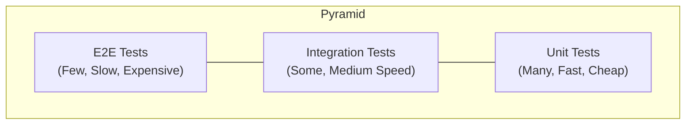
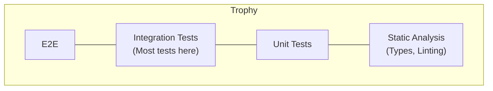
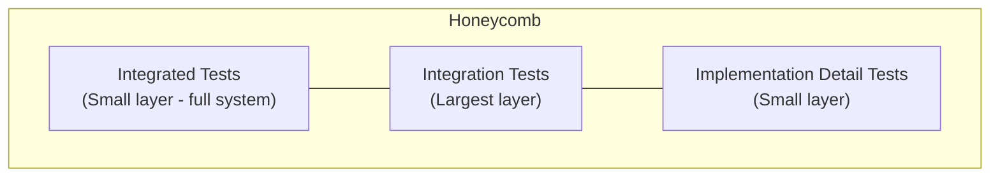

# Testing Philosophy

Before writing a single test, you need to understand *why* testing matters, *what* to test, and *how much* testing is enough. This section establishes the mental models that guide every testing decision you'll make.

## Why Test?

Testing exists to answer one question: **does this software do what it should?**

But the deeper motivations are:

| Motivation | What It Means |
|---|---|
| **Confidence in change** | Refactor, upgrade, or extend without fear of breaking existing behaviour |
| **Documentation** | Tests describe what the system *actually does*, not what someone intended |
| **Design feedback** | Hard-to-test code is often poorly designed — tests push toward better architecture |
| **Defect prevention** | Catching bugs in development costs 10–100× less than in production |
| **Speed** | Automated checks run in seconds; manual verification takes minutes to hours |

### The Cost of Bugs Over Time

The later a defect is found, the more expensive it is to fix:


This isn't just about money — it's about context. A bug found during development takes minutes to fix because the code is fresh in your mind. The same bug in production requires incident response, root cause analysis, hotfix, deployment, and customer communication.

## Testing Models

### The Test Pyramid

The classic model proposed by Mike Cohn:



| Layer | Count | Speed | Confidence | Maintenance |
|---|---|---|---|---|
| Unit | Many (hundreds) | Milliseconds | Low–Medium | Low |
| Integration | Some (dozens) | Seconds | Medium–High | Medium |
| E2E | Few (handful) | Minutes | High | High |

**Core idea:** Build a wide base of fast unit tests, fewer integration tests, and minimal end-to-end tests.

### The Testing Trophy

Kent C. Dodds proposed this alternative for frontend/full-stack applications:



**Core idea:** Integration tests give the best balance of confidence and speed. Static analysis (TypeScript, ESLint) catches many bugs that unit tests would otherwise cover.

### The Testing Honeycomb

Spotify's model for microservices:



**Core idea:** In microservices, integration tests (testing a single service with its real dependencies) give the most value. Pure unit tests of implementation details provide less confidence.

### Which Model to Follow?

| Context | Best Model | Reason |
|---|---|---|
| Library / utility code | Pyramid | Pure logic benefits from extensive unit tests |
| Web application (full-stack) | Trophy | Integration tests catch real user-facing bugs |
| Microservices | Honeycomb | Service contracts and integrations matter most |
| CLI tool | Pyramid | Mostly pure logic with clear I/O boundaries |
| Data pipeline | Honeycomb | Integration with real data sources is critical |

## What to Test

### Test Behaviour, Not Implementation

```python
# ❌ Testing implementation (brittle)
def test_sort_uses_quicksort():
    sorter = Sorter()
    sorter.sort([3, 1, 2])
    assert sorter._algorithm_used == "quicksort"

# ✅ Testing behaviour (resilient)
def test_sort_returns_ordered_list():
    assert sort_numbers([3, 1, 2]) == [1, 2, 3]
```

### The Testing Quadrant

| | Business-Facing | Technology-Facing |
|---|---|---|
| **Guide Development** | Acceptance tests (BDD) | Unit tests, integration tests |
| **Critique the Product** | Exploratory testing, usability | Performance tests, security tests |

### What NOT to Test

- Language features (don't test that `if` statements work)
- Third-party library internals (test your *usage* of them)
- Trivial getters/setters with no logic
- Private implementation details that might change
- Generated code (test the generator or the output contract)

## Testing vs Type Systems

Static types and tests serve overlapping but distinct purposes:

| Aspect | Type System | Tests |
|---|---|---|
| Catches | Shape errors, null references, wrong types | Logic errors, edge cases, integration bugs |
| Speed | Instant (at compile/save time) | Seconds to minutes |
| Completeness | Proves absence of type errors | Proves presence of correct behaviour for *tested cases* |
| Maintenance | Zero (types are the code) | Ongoing (tests must be updated) |
| Business logic | Cannot verify | Can verify |

**They complement each other:**

```typescript
// TypeScript catches: passing a string where number expected
function calculateDiscount(price: number, percentage: number): number {
  return price * (1 - percentage / 100);
}

// Tests catch: logic error with boundary values
test('discount of 100% returns zero', () => {
  expect(calculateDiscount(50, 100)).toBe(0);
});

test('discount cannot exceed price', () => {
  expect(calculateDiscount(50, 150)).toBe(-25); // Bug! Should this be 0?
});
```

## Building a Testing Culture

### Signs of a Healthy Testing Culture

- Tests are written *with* the code, not after
- CI fails on test failures — no one merges broken tests
- Flaky tests are fixed immediately, not ignored
- Test coverage is tracked but not weaponized
- Developers trust the test suite enough to refactor confidently

### Signs of a Toxic Testing Culture

- Coverage targets enforced without quality standards (leads to meaningless tests)
- Tests only written to satisfy a metric, not to catch bugs
- "Tests slow us down" — usually means tests are too coupled to implementation
- Test suite takes 45 minutes — nobody runs it locally
- Flaky tests normalised with "just re-run the pipeline"

### Coverage: A Useful Metric, Not a Goal

```python
# 100% coverage, zero value
def add(a, b):
    return a + b

def test_add():
    assert add(1, 1) == 2  # Covers the line, doesn't test edge cases
```

Better questions than "what's our coverage?":
- Can I refactor this module and trust that tests will catch regressions?
- Do our tests catch the bugs we actually ship?
- How long does it take a new developer to understand the system from tests alone?

## Key Principles

1. **Test behaviour, not implementation** — Tests should survive refactoring
2. **Fast feedback** — If tests are slow, developers won't run them
3. **Deterministic** — Same input, same result, every time
4. **Independent** — Tests don't depend on execution order or shared state
5. **Readable** — A failing test should immediately tell you what went wrong

## Key Takeaways

- Testing is about confidence in change, not proving correctness
- Choose your testing model (pyramid/trophy/honeycomb) based on your system architecture
- Test behaviour and contracts, not implementation details
- Types and tests are complementary — use both
- Coverage is a signal, not a target — optimise for defect detection, not line coverage
- A healthy testing culture treats tests as first-class citizens alongside production code
