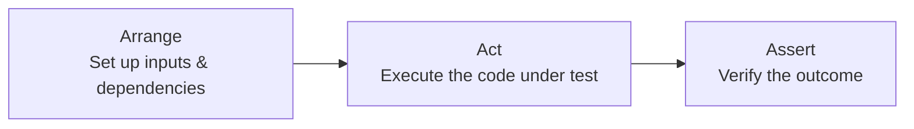

# Unit Testing

Unit tests verify the smallest pieces of your code in isolation. They're fast, focused, and form the foundation of any test suite. This section covers patterns and practices for writing effective unit tests.

## The AAA Pattern

Every well-structured unit test follows three phases:



### Python Example

```python
def test_calculate_total_with_discount():
    # Arrange
    items = [
        {"name": "Widget", "price": 25.00, "quantity": 2},
        {"name": "Gadget", "price": 15.00, "quantity": 1},
    ]
    discount_percentage = 10

    # Act
    total = calculate_total(items, discount=discount_percentage)

    # Assert
    assert total == 58.50  # (50 + 15) * 0.90
```

### JavaScript Example

```javascript
test('calculate total applies discount correctly', () => {
  // Arrange
  const items = [
    { name: 'Widget', price: 25.00, quantity: 2 },
    { name: 'Gadget', price: 15.00, quantity: 1 },
  ];
  const discount = 10;

  // Act
  const total = calculateTotal(items, { discount });

  // Assert
  expect(total).toBe(58.50);
});
```

### Rules for AAA

| Phase | Guidelines |
|---|---|
| **Arrange** | Set up only what's needed for *this* test. Use helpers/factories for complex setup. |
| **Act** | Exactly one action. If you need multiple actions, it's probably multiple tests. |
| **Assert** | Check one logical concept (may be multiple `assert` statements for one concept). |

## Test Naming

Good test names describe the scenario and expected outcome:

### Naming Patterns

| Pattern | Example |
|---|---|
| `test_<behaviour>` | `test_empty_cart_returns_zero_total` |
| `test_<method>_<scenario>_<expected>` | `test_parse_date_invalid_format_raises_error` |
| `it should <behaviour> when <condition>` | `it should return 404 when user not found` |
| `<method> → <scenario> → <expected>` | `calculateTax → negative income → throws` |

```python
# ❌ Bad names — what do these test?
def test_process():
    ...

def test_handler_1():
    ...

# ✅ Good names — self-documenting
def test_process_payment_insufficient_funds_returns_declined():
    ...

def test_handler_returns_404_when_user_id_not_found():
    ...
```

```javascript
// ❌ Bad
test('works', () => { ... });

// ✅ Good
test('rejects email addresses without @ symbol', () => { ... });
test('returns empty array when no results match filter', () => { ... });
```

## Fixtures and Factories

### Fixtures (Static Test Data)

Fixtures provide pre-built test data that multiple tests can share:

```python
import pytest

@pytest.fixture
def sample_user():
    return {
        "id": "usr_123",
        "name": "Alice",
        "email": "alice@example.com",
        "role": "admin",
    }

@pytest.fixture
def sample_order(sample_user):
    return {
        "id": "ord_456",
        "user_id": sample_user["id"],
        "items": [{"sku": "ABC", "qty": 2, "price": 10.00}],
        "status": "pending",
    }

def test_order_total(sample_order):
    assert calculate_order_total(sample_order) == 20.00
```

### Factories (Dynamic Test Data)

Factories generate test data with sensible defaults and easy overrides:

```python
def make_user(**overrides):
    defaults = {
        "id": "usr_" + str(uuid4())[:8],
        "name": "Test User",
        "email": "test@example.com",
        "role": "viewer",
        "active": True,
    }
    return {**defaults, **overrides}

def test_admin_can_delete_users():
    admin = make_user(role="admin")
    target = make_user(name="Bob")
    result = delete_user(actor=admin, target_id=target["id"])
    assert result.success is True

def test_viewer_cannot_delete_users():
    viewer = make_user(role="viewer")
    target = make_user(name="Bob")
    with pytest.raises(PermissionError):
        delete_user(actor=viewer, target_id=target["id"])
```

```javascript
function makeUser(overrides = {}) {
  return {
    id: `usr_${Math.random().toString(36).slice(2, 10)}`,
    name: 'Test User',
    email: 'test@example.com',
    role: 'viewer',
    active: true,
    ...overrides,
  };
}

test('admin can delete users', () => {
  const admin = makeUser({ role: 'admin' });
  const target = makeUser({ name: 'Bob' });
  expect(() => deleteUser(admin, target.id)).not.toThrow();
});
```

## Parameterized Tests

When the same logic needs testing with multiple inputs:

```python
import pytest

@pytest.mark.parametrize("input_str,expected", [
    ("hello", "HELLO"),
    ("", ""),
    ("Hello World", "HELLO WORLD"),
    ("123", "123"),
    ("café", "CAFÉ"),
])
def test_uppercase(input_str, expected):
    assert to_uppercase(input_str) == expected


@pytest.mark.parametrize("email,is_valid", [
    ("user@example.com", True),
    ("user@sub.domain.com", True),
    ("user@", False),
    ("@domain.com", False),
    ("no-at-sign", False),
    ("user@.com", False),
])
def test_email_validation(email, is_valid):
    assert validate_email(email) == is_valid
```

```javascript
test.each([
  ['hello', 'HELLO'],
  ['', ''],
  ['Hello World', 'HELLO WORLD'],
  ['123', '123'],
])('toUpperCase("%s") returns "%s"', (input, expected) => {
  expect(toUpperCase(input)).toBe(expected);
});
```

## Testing Pure Functions

Pure functions (no side effects, same input → same output) are the easiest to test:

```python
def calculate_tax(income: float, rate: float) -> float:
    if income <= 0:
        return 0.0
    return round(income * rate, 2)

class TestCalculateTax:
    def test_positive_income(self):
        assert calculate_tax(50000, 0.20) == 10000.0

    def test_zero_income(self):
        assert calculate_tax(0, 0.20) == 0.0

    def test_negative_income_treated_as_zero(self):
        assert calculate_tax(-1000, 0.20) == 0.0

    def test_rounding(self):
        assert calculate_tax(33.33, 0.07) == 2.33
```

## Testing with Dependencies

When code has external dependencies, you test the logic separately from the integration:

```python
# Production code
class OrderService:
    def __init__(self, repository, payment_gateway):
        self.repository = repository
        self.payment_gateway = payment_gateway

    def place_order(self, order):
        if order.total <= 0:
            raise ValueError("Order total must be positive")

        payment = self.payment_gateway.charge(order.total)
        if not payment.success:
            raise PaymentError(payment.error)

        order.status = "confirmed"
        order.payment_id = payment.id
        self.repository.save(order)
        return order

# Unit test — dependencies are injected, so we can substitute them
def test_place_order_charges_correct_amount():
    repo = FakeRepository()
    gateway = FakePaymentGateway(always_succeeds=True)
    service = OrderService(repo, gateway)

    order = make_order(total=99.99)
    service.place_order(order)

    assert gateway.last_charge_amount == 99.99

def test_place_order_rejects_zero_total():
    repo = FakeRepository()
    gateway = FakePaymentGateway()
    service = OrderService(repo, gateway)

    with pytest.raises(ValueError, match="positive"):
        service.place_order(make_order(total=0))
```

## Assertion Libraries

### Python — `assert` with pytest

```python
# pytest enhances plain assert with detailed diffs
assert result == expected
assert "error" in message
assert len(items) == 3
assert all(item.active for item in items)

# For exceptions
with pytest.raises(ValueError, match="invalid"):
    parse_date("not-a-date")

# Approximate floating point
assert result == pytest.approx(3.14159, rel=1e-5)
```

### JavaScript — Jest/Vitest

```javascript
expect(result).toBe(42);              // strict equality
expect(result).toEqual({ a: 1 });     // deep equality
expect(list).toHaveLength(3);
expect(list).toContain('item');
expect(fn).toThrow(/invalid/);
expect(result).toBeCloseTo(3.14, 2);  // floating point
expect(obj).toMatchObject({ id: 1 }); // partial match
```

### Comparison Table

| Need | Python (pytest) | JavaScript (Jest) |
|---|---|---|
| Equality | `assert a == b` | `expect(a).toBe(b)` |
| Deep equality | `assert a == b` (works for dicts/lists) | `expect(a).toEqual(b)` |
| Contains | `assert x in collection` | `expect(arr).toContain(x)` |
| Exception | `pytest.raises(Error)` | `expect(fn).toThrow()` |
| Approximate | `pytest.approx(val)` | `expect(val).toBeCloseTo(n)` |
| Truthiness | `assert condition` | `expect(val).toBeTruthy()` |

## Common Anti-Patterns

| Anti-Pattern | Problem | Fix |
|---|---|---|
| **Multiple acts** | Test does too many things | Split into separate tests |
| **Testing implementation** | Breaks on refactor | Test observable behaviour |
| **Shared mutable state** | Tests affect each other | Fresh setup per test |
| **Overly specific assertions** | Brittle to irrelevant changes | Assert on what matters |
| **No assertion** | Test always passes | Every test must assert something |
| **Conditional logic in tests** | Tests should be linear | Remove if/else from tests |

## Key Takeaways

- Follow the AAA pattern (Arrange-Act-Assert) for clear, consistent test structure
- Name tests to describe the scenario and expected outcome — they're documentation
- Use factories over fixtures when you need variation across tests
- Parameterized tests eliminate repetition for multi-input scenarios
- Pure functions are trivial to test — design for purity where possible
- Inject dependencies to make code testable without complex mocking
- Choose assertions that give clear failure messages when they break
