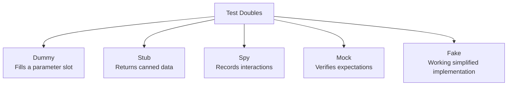
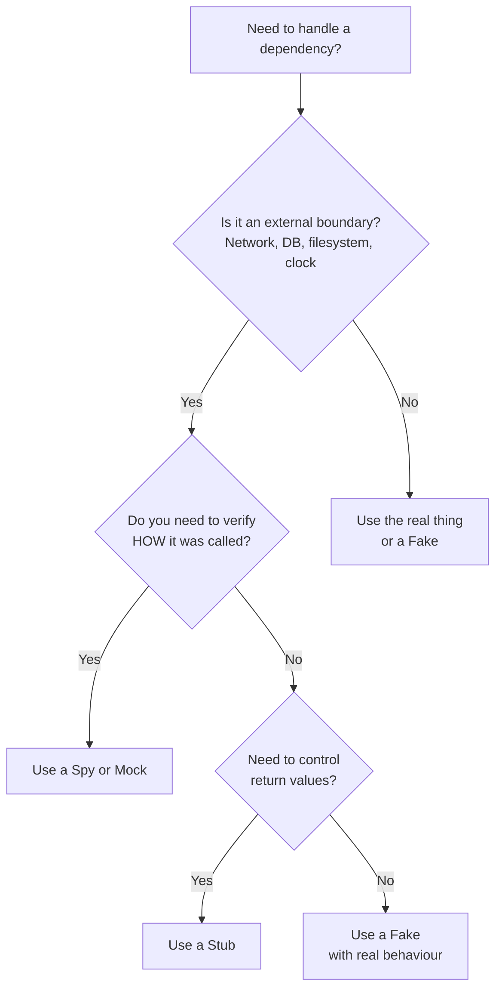

# Mocking & Test Doubles

When code depends on external systems — databases, APIs, file systems, or clocks — you need strategies to test in isolation. Test doubles replace real dependencies with controlled substitutes. This section covers types of doubles, when to use them, and how to avoid the over-mocking trap.

## Types of Test Doubles



### Comparison Table

| Double | Purpose | Verifies Behaviour? | Has Logic? | Example |
|---|---|---|---|---|
| **Dummy** | Satisfies a type signature, never actually used | No | No | A null logger passed to a constructor |
| **Stub** | Returns pre-configured responses | No | Minimal | `get_user()` always returns `{"id": 1, "name": "Alice"}` |
| **Spy** | Records calls for later verification | Yes (after the fact) | No | Records that `send_email` was called with specific args |
| **Mock** | Expects specific calls — fails if not met | Yes (built-in) | No | Expects `repository.save(order)` to be called exactly once |
| **Fake** | Simplified but functional implementation | No | Yes | In-memory database, local file system |

### When to Use Each

| Situation | Best Double |
|---|---|
| Dependency is irrelevant to this test | Dummy |
| Need to control what dependency returns | Stub |
| Need to verify *how* something was called (args, count) | Spy or Mock |
| Need a working substitute with real behaviour | Fake |
| Need to prevent real side effects (emails, charges) | Stub or Fake |

## Practical Examples

### Stubs — Controlling Return Values

```python
from unittest.mock import patch

def get_weather_message(city: str) -> str:
    """Fetches weather and formats a message."""
    data = weather_api.get_current(city)  # External call
    return f"{city}: {data['temp']}°C, {data['condition']}"

@patch("src.weather.weather_api.get_current")
def test_weather_message_formatting(mock_api):
    # Stub: control the return value
    mock_api.return_value = {"temp": 22, "condition": "sunny"}

    result = get_weather_message("Madrid")

    assert result == "Madrid: 22°C, sunny"
```

```javascript
// Jest stub
jest.spyOn(weatherApi, 'getCurrent').mockResolvedValue({
  temp: 22,
  condition: 'sunny',
});

test('formats weather message correctly', async () => {
  const result = await getWeatherMessage('Madrid');
  expect(result).toBe('Madrid: 22°C, sunny');
});
```

### Spies — Verifying Interactions

```python
from unittest.mock import MagicMock

def test_order_sends_confirmation_email():
    email_service = MagicMock()
    order_service = OrderService(email_service=email_service)

    order_service.complete_order(order_id="ord_123")

    # Spy: verify the interaction happened correctly
    email_service.send.assert_called_once_with(
        to="customer@example.com",
        subject="Order Confirmed",
        template="order_confirmation",
        data={"order_id": "ord_123"},
    )
```

```javascript
test('sends confirmation email on order completion', () => {
  const sendEmail = jest.fn();
  const service = new OrderService({ sendEmail });

  service.completeOrder('ord_123');

  expect(sendEmail).toHaveBeenCalledWith(
    expect.objectContaining({
      to: 'customer@example.com',
      subject: 'Order Confirmed',
    })
  );
});
```

### Fakes — Simplified Real Implementations

```python
class FakeUserRepository:
    """In-memory implementation for testing."""

    def __init__(self):
        self._users = {}

    def save(self, user):
        self._users[user["id"]] = user

    def find_by_id(self, user_id):
        return self._users.get(user_id)

    def find_by_email(self, email):
        return next(
            (u for u in self._users.values() if u["email"] == email),
            None,
        )

def test_register_user_saves_and_retrieves():
    repo = FakeUserRepository()
    service = UserService(repository=repo)

    service.register(name="Alice", email="alice@test.com")

    user = repo.find_by_email("alice@test.com")
    assert user is not None
    assert user["name"] == "Alice"
```

## When to Mock

### Good Reasons to Mock

| Reason | Example |
|---|---|
| **Non-deterministic** | Current time, random values, UUIDs |
| **Slow** | Network calls, database queries in unit tests |
| **Side effects** | Sending emails, charging credit cards, writing files |
| **Unavailable** | Third-party API not accessible in CI |
| **Hard to trigger** | Network timeouts, disk full, race conditions |

### Bad Reasons to Mock

| Reason | Better Approach |
|---|---|
| "It's complex" | Simplify the design instead |
| "It's another class I wrote" | Test them together (integration test) |
| "To get coverage" | Write a meaningful test instead |
| "Everyone else does it" | Question whether it adds value |

## The Over-Mocking Anti-Pattern

Over-mocking happens when tests mock so many things that they test nothing real:

```python
# ❌ Over-mocked — tests only that code is wired together
@patch("src.service.repository.find")
@patch("src.service.validator.validate")
@patch("src.service.transformer.transform")
@patch("src.service.publisher.publish")
def test_process(mock_pub, mock_trans, mock_val, mock_find):
    mock_find.return_value = {"id": 1}
    mock_val.return_value = True
    mock_trans.return_value = {"processed": True}

    process(item_id=1)

    mock_pub.assert_called_once()
    # What did we actually test? Just that 4 functions are called in order.
```

```python
# ✅ Better — test real logic, mock only the boundary
def test_process_transforms_data_correctly():
    repo = FakeRepository(items=[{"id": 1, "raw": "data"}])
    publisher = FakePublisher()

    process(item_id=1, repository=repo, publisher=publisher)

    assert publisher.last_published == {"id": 1, "processed": "DATA"}
```

### Signs of Over-Mocking

- Test has more mock setup than assertions
- Changing any implementation detail breaks the test
- Test passes even when production code has bugs
- You're mocking things you own (not external boundaries)

## Dependency Injection for Testability

The key enabler for effective testing is **dependency injection** — passing dependencies in rather than creating them inside:

```python
# ❌ Hard to test — creates its own dependency
class ReportGenerator:
    def generate(self, data):
        db = PostgresConnection("prod-host", 5432)  # Can't substitute!
        records = db.query("SELECT * FROM reports")
        return format_report(records, data)

# ✅ Easy to test — dependency is injected
class ReportGenerator:
    def __init__(self, database):
        self.database = database

    def generate(self, data):
        records = self.database.query("SELECT * FROM reports")
        return format_report(records, data)

# In production
generator = ReportGenerator(database=PostgresConnection("prod-host", 5432))

# In tests
generator = ReportGenerator(database=FakeDatabase(records=[...]))
```

```javascript
// ❌ Hard to test
async function fetchUserProfile(userId) {
  const response = await fetch(`https://api.example.com/users/${userId}`);
  return response.json();
}

// ✅ Easy to test — HTTP client is injectable
async function fetchUserProfile(userId, { httpClient = fetch } = {}) {
  const response = await httpClient(`https://api.example.com/users/${userId}`);
  return response.json();
}

// In tests
const mockClient = async () => ({ json: async () => ({ id: 1, name: 'Alice' }) });
const profile = await fetchUserProfile('1', { httpClient: mockClient });
```

## Mocking HTTP Calls

### Python — `responses` library

```python
import responses
import requests

@responses.activate
def test_fetch_user_from_api():
    responses.add(
        responses.GET,
        "https://api.example.com/users/123",
        json={"id": 123, "name": "Alice"},
        status=200,
    )

    user = fetch_user(user_id=123)

    assert user["name"] == "Alice"
    assert len(responses.calls) == 1

@responses.activate
def test_fetch_user_handles_404():
    responses.add(
        responses.GET,
        "https://api.example.com/users/999",
        json={"error": "not found"},
        status=404,
    )

    with pytest.raises(UserNotFoundError):
        fetch_user(user_id=999)
```

### JavaScript — `msw` (Mock Service Worker)

```javascript
import { rest } from 'msw';
import { setupServer } from 'msw/node';

const server = setupServer(
  rest.get('https://api.example.com/users/:id', (req, res, ctx) => {
    return res(ctx.json({ id: req.params.id, name: 'Alice' }));
  })
);

beforeAll(() => server.listen());
afterEach(() => server.resetHandlers());
afterAll(() => server.close());

test('fetches user profile', async () => {
  const user = await fetchUser('123');
  expect(user.name).toBe('Alice');
});

test('handles server error', async () => {
  server.use(
    rest.get('https://api.example.com/users/:id', (req, res, ctx) => {
      return res(ctx.status(500));
    })
  );
  await expect(fetchUser('123')).rejects.toThrow();
});
```

## Mocking Databases

### Strategy: Don't Mock the DB — Fake It or Use Transactions

```python
# Fake (in-memory) — best for unit tests
class InMemoryOrderRepo:
    def __init__(self):
        self._orders = {}

    def save(self, order):
        self._orders[order.id] = order

    def find_by_id(self, order_id):
        return self._orders.get(order_id)

    def find_by_status(self, status):
        return [o for o in self._orders.values() if o.status == status]
```

For integration tests, prefer real databases with transaction rollback (covered in section 04).

## Test Double Decision Flowchart



## Key Takeaways

- Test doubles come in varieties — dummies, stubs, spies, mocks, and fakes serve different purposes
- Mock at boundaries (network, DB, filesystem), not between your own classes
- Over-mocking is the #1 testing anti-pattern — it makes tests brittle and meaningless
- Dependency injection is the key to testable code; if you can't inject it, you can't substitute it
- Prefer fakes over mocks when the dependency has complex behaviour — they catch more real bugs
- Use HTTP mocking libraries (`responses`, `msw`) for clean API test doubles
- If you're mocking more than 2–3 things in one test, reconsider your design
