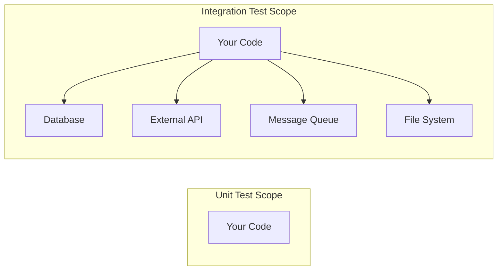
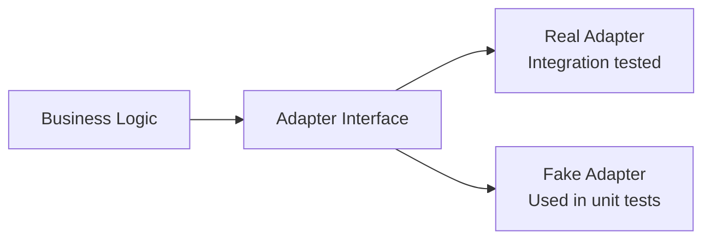

# Integration Testing

Unit tests verify logic in isolation. Integration tests verify that components work *together* — your code with a real database, your service with a real HTTP API, your function with the real filesystem. This section covers strategies for testing these interactions reliably.

## What Integration Tests Cover



| Aspect | Unit Test | Integration Test |
|---|---|---|
| **Dependencies** | Mocked/faked | Real (or realistic containers) |
| **Speed** | Milliseconds | Seconds |
| **What it catches** | Logic errors | Wiring errors, serialization bugs, query bugs |
| **Reliability** | Deterministic | May flake if external systems are unstable |
| **Setup complexity** | Low | Medium–High |

### What Integration Tests Catch That Unit Tests Miss

- SQL syntax errors and wrong column names
- Serialization/deserialization mismatches (JSON ↔ object)
- HTTP header issues, content-type mismatches
- Transaction isolation problems
- Connection pool exhaustion
- File permission issues
- Environment variable misconfiguration

## Database Testing

### Strategy 1: Testcontainers (Recommended)

Testcontainers spins up real databases in Docker for your tests:

```python
# Python with testcontainers
import pytest
from testcontainers.postgres import PostgresContainer

@pytest.fixture(scope="session")
def postgres():
    with PostgresContainer("postgres:16") as pg:
        yield pg

@pytest.fixture
def db_connection(postgres):
    conn = psycopg2.connect(postgres.get_connection_url())
    yield conn
    conn.rollback()  # Clean up after each test
    conn.close()

def test_save_and_retrieve_user(db_connection):
    repo = UserRepository(db_connection)

    repo.save(User(name="Alice", email="alice@test.com"))
    user = repo.find_by_email("alice@test.com")

    assert user is not None
    assert user.name == "Alice"
```

```javascript
// JavaScript with testcontainers
import { PostgreSqlContainer } from '@testcontainers/postgresql';

let container;
let pool;

beforeAll(async () => {
  container = await new PostgreSqlContainer().start();
  pool = new Pool({ connectionString: container.getConnectionUri() });
  await runMigrations(pool);
});

afterAll(async () => {
  await pool.end();
  await container.stop();
});

test('saves and retrieves user', async () => {
  const repo = new UserRepository(pool);

  await repo.save({ name: 'Alice', email: 'alice@test.com' });
  const user = await repo.findByEmail('alice@test.com');

  expect(user.name).toBe('Alice');
});
```

### Strategy 2: Transaction Rollback

Each test runs inside a transaction that's rolled back at the end:

```python
@pytest.fixture
def db_session(db_engine):
    connection = db_engine.connect()
    transaction = connection.begin()
    session = Session(bind=connection)

    yield session

    session.close()
    transaction.rollback()  # All changes undone
    connection.close()

def test_create_order(db_session):
    order = Order(customer_id=1, total=99.99)
    db_session.add(order)
    db_session.flush()

    result = db_session.query(Order).filter_by(customer_id=1).first()
    assert result.total == 99.99
    # Transaction rolls back — database stays clean
```

### Strategy 3: Fixtures with Known State

Seed the database before tests, tear down after:

```python
@pytest.fixture(autouse=True)
def seed_database(db_connection):
    """Insert known test data before each test."""
    db_connection.execute("""
        INSERT INTO users (id, name, email) VALUES
        (1, 'Alice', 'alice@test.com'),
        (2, 'Bob', 'bob@test.com');
    """)
    db_connection.commit()

    yield

    db_connection.execute("DELETE FROM users")
    db_connection.commit()
```

### Comparison

| Strategy | Pros | Cons |
|---|---|---|
| **Testcontainers** | Real DB, isolated, CI-friendly | Slower startup, needs Docker |
| **Transaction rollback** | Fast, clean, no teardown needed | Can't test commit behaviour |
| **Fixtures** | Predictable known state | Manual cleanup, order-dependent |

## API Testing

### Testing Your Own API Endpoints

```python
# FastAPI example with TestClient
from fastapi.testclient import TestClient
from src.app import app

client = TestClient(app)

def test_create_user_returns_201():
    response = client.post(
        "/api/users",
        json={"name": "Alice", "email": "alice@test.com"},
    )
    assert response.status_code == 201
    assert response.json()["name"] == "Alice"
    assert "id" in response.json()

def test_create_user_duplicate_email_returns_409():
    client.post("/api/users", json={"name": "Alice", "email": "alice@test.com"})
    response = client.post(
        "/api/users",
        json={"name": "Bob", "email": "alice@test.com"},
    )
    assert response.status_code == 409

def test_get_user_not_found_returns_404():
    response = client.get("/api/users/nonexistent-id")
    assert response.status_code == 404
```

```javascript
// Express with supertest
import request from 'supertest';
import app from '../src/app';

describe('POST /api/users', () => {
  test('creates user and returns 201', async () => {
    const response = await request(app)
      .post('/api/users')
      .send({ name: 'Alice', email: 'alice@test.com' })
      .expect(201);

    expect(response.body).toMatchObject({
      name: 'Alice',
      email: 'alice@test.com',
    });
    expect(response.body.id).toBeDefined();
  });

  test('returns 400 for invalid email', async () => {
    await request(app)
      .post('/api/users')
      .send({ name: 'Alice', email: 'not-an-email' })
      .expect(400);
  });
});
```

### Testing Against External APIs

For external APIs you don't control, use contract tests or recorded responses:

```python
# Record and replay with VCR.py
import vcr

@vcr.use_cassette("tests/cassettes/github_user.yaml")
def test_fetch_github_user():
    """First run hits real API and records. Subsequent runs use recording."""
    user = fetch_github_user("octocat")
    assert user["login"] == "octocat"
    assert "id" in user
```

## File System Testing

### Use Temporary Directories

```python
import tempfile
import os

def test_export_writes_csv_file(tmp_path):
    """pytest's tmp_path fixture provides a unique temp directory."""
    output_file = tmp_path / "report.csv"

    export_report(data=[{"name": "Alice", "score": 95}], path=str(output_file))

    assert output_file.exists()
    content = output_file.read_text()
    assert "Alice" in content
    assert "95" in content
```

```javascript
import fs from 'fs';
import os from 'os';
import path from 'path';

test('export writes CSV file', () => {
  const tmpDir = fs.mkdtempSync(path.join(os.tmpdir(), 'test-'));
  const outputPath = path.join(tmpDir, 'report.csv');

  exportReport([{ name: 'Alice', score: 95 }], outputPath);

  const content = fs.readFileSync(outputPath, 'utf-8');
  expect(content).toContain('Alice');
  expect(content).toContain('95');

  // Cleanup
  fs.rmSync(tmpDir, { recursive: true });
});
```

## External Service Testing

### Pattern: Test Adapter Separately



```python
# Define the interface
class PaymentGateway:
    def charge(self, amount: float, card_token: str) -> PaymentResult:
        raise NotImplementedError

# Real implementation — integration tested
class StripeGateway(PaymentGateway):
    def charge(self, amount, card_token):
        response = stripe.Charge.create(amount=int(amount * 100), source=card_token)
        return PaymentResult(success=True, id=response.id)

# Integration test (runs against Stripe test mode)
def test_stripe_gateway_charges_test_card():
    gateway = StripeGateway(api_key="sk_test_...")
    result = gateway.charge(amount=10.00, card_token="tok_visa")
    assert result.success is True
    assert result.id.startswith("ch_")
```

## Test Isolation

Integration tests must not affect each other. Key strategies:

| Strategy | How | When |
|---|---|---|
| **Transaction rollback** | Wrap each test in a transaction, rollback after | Database tests |
| **Unique identifiers** | Generate unique keys per test | Shared external services |
| **Dedicated containers** | Fresh container per test suite | Heavy isolation needs |
| **Cleanup hooks** | Delete created resources in teardown | External APIs |
| **Parallel-safe design** | No shared mutable state between tests | All integration tests |

### Isolation Anti-Patterns

```python
# ❌ Tests depend on execution order
def test_create_user():
    create_user("alice@test.com")

def test_find_user():
    user = find_user("alice@test.com")  # Depends on test above!
    assert user is not None

# ✅ Each test is independent
def test_create_and_find_user():
    create_user("alice@test.com")
    user = find_user("alice@test.com")
    assert user is not None
```

## Structuring Integration Tests

```
tests/
├── unit/                    # Fast, no external deps
│   ├── test_calculator.py
│   └── test_validator.py
├── integration/             # Real deps, slower
│   ├── conftest.py          # Shared fixtures (DB containers, etc.)
│   ├── test_user_repo.py
│   ├── test_order_api.py
│   └── test_email_service.py
└── conftest.py              # Top-level fixtures
```

Run separately in CI:

```yaml
# CI pipeline
unit-tests:
  script: pytest tests/unit/ -v --timeout=10

integration-tests:
  script: pytest tests/integration/ -v --timeout=60
  services:
    - postgres:16
    - redis:7
```

## Key Takeaways

- Integration tests verify that components work together — they catch wiring bugs that unit tests miss
- Testcontainers provide real databases in Docker — the gold standard for database integration tests
- Transaction rollback keeps database tests fast and isolated
- Test your own API endpoints with in-process test clients (TestClient, supertest)
- For external APIs, use recorded responses (VCR) or contract tests
- Every integration test must be independent — no reliance on execution order or shared state
- Separate integration tests from unit tests in your directory structure and CI pipeline
