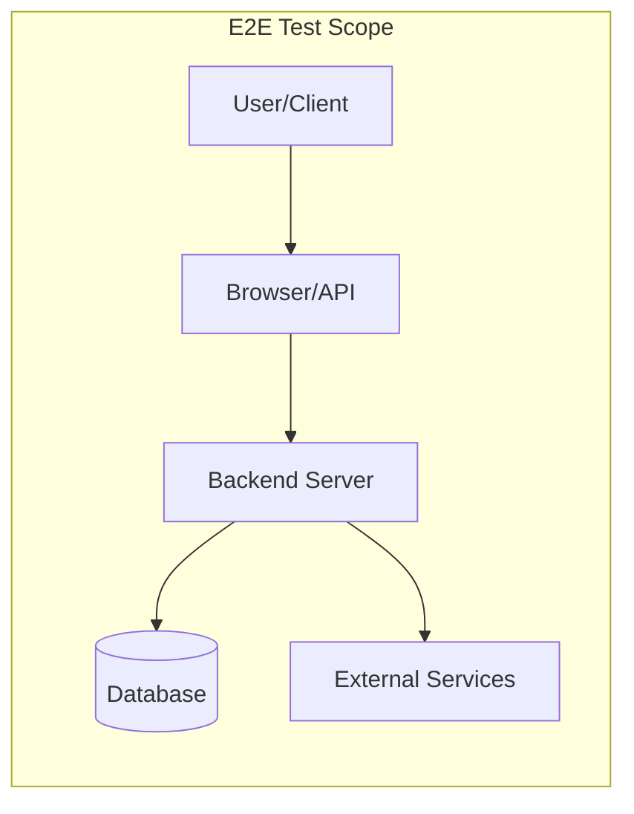
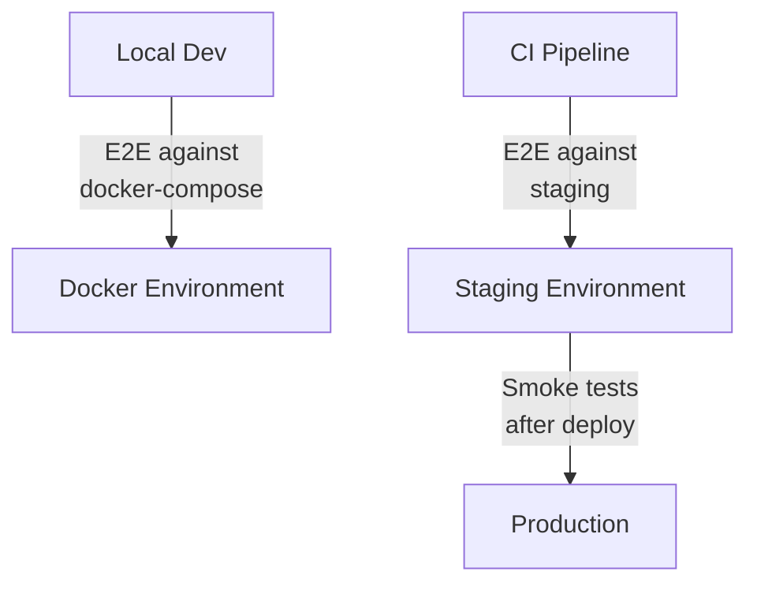

# End-to-End Testing

End-to-end (E2E) tests verify complete user workflows through the full application stack — from the browser or API client, through your backend, to the database and back. They provide the highest confidence but are the slowest and most maintenance-intensive.

## What E2E Tests Cover



| Characteristic | E2E Tests |
|---|---|
| **Scope** | Full system, multiple components |
| **Speed** | Seconds to minutes per test |
| **Confidence** | Highest — tests real user experience |
| **Maintenance** | High — brittle to UI/flow changes |
| **Debugging** | Hard — failures could be anywhere in the stack |
| **Count** | Few — cover critical paths only |

### What to E2E Test

- **Critical user journeys** — signup, login, checkout, payment
- **Cross-system flows** — data that passes through multiple services
- **Smoke tests** — "does the app start and load?" after deployment
- **Regression tests** — for bugs that slipped through other test layers

### What NOT to E2E Test

- Edge cases (use unit tests)
- Every possible form validation (use unit/integration tests)
- Internal API responses (use API-level integration tests)
- Visual pixel-perfection (use visual regression tests separately)

## Browser Testing

### Playwright (Recommended)

```javascript
// tests/e2e/checkout.spec.js
import { test, expect } from '@playwright/test';

test('user can complete checkout flow', async ({ page }) => {
  // Navigate and add item to cart
  await page.goto('/products');
  await page.click('[data-testid="product-widget"]');
  await page.click('button:text("Add to Cart")');

  // Go to cart and proceed to checkout
  await page.click('[data-testid="cart-icon"]');
  await expect(page.locator('.cart-item')).toHaveCount(1);
  await page.click('button:text("Checkout")');

  // Fill shipping information
  await page.fill('[name="address"]', '123 Test Street');
  await page.fill('[name="city"]', 'Barcelona');
  await page.fill('[name="zip"]', '08001');

  // Submit order
  await page.click('button:text("Place Order")');

  // Verify confirmation
  await expect(page.locator('.order-confirmation')).toBeVisible();
  await expect(page.locator('.order-id')).toContainText(/ORD-/);
});
```

### Cypress

```javascript
// cypress/e2e/login.cy.js
describe('Login Flow', () => {
  beforeEach(() => {
    cy.visit('/login');
  });

  it('logs in with valid credentials', () => {
    cy.get('[data-testid="email-input"]').type('alice@example.com');
    cy.get('[data-testid="password-input"]').type('secure123');
    cy.get('[data-testid="login-button"]').click();

    cy.url().should('include', '/dashboard');
    cy.get('[data-testid="welcome-message"]')
      .should('contain', 'Welcome, Alice');
  });

  it('shows error for invalid credentials', () => {
    cy.get('[data-testid="email-input"]').type('alice@example.com');
    cy.get('[data-testid="password-input"]').type('wrong');
    cy.get('[data-testid="login-button"]').click();

    cy.get('[data-testid="error-message"]')
      .should('be.visible')
      .and('contain', 'Invalid credentials');
    cy.url().should('include', '/login');
  });
});
```

### Playwright vs Cypress

| Feature | Playwright | Cypress |
|---|---|---|
| **Languages** | JS, Python, Java, .NET | JavaScript only |
| **Browsers** | Chromium, Firefox, WebKit | Chromium, Firefox, WebKit |
| **Parallelism** | Built-in | Requires paid Cloud |
| **Multi-tab/window** | Supported | Not supported |
| **Network interception** | Full control | Good (cy.intercept) |
| **Auto-waiting** | Built-in | Built-in |
| **iframes** | Full support | Limited |
| **Best for** | Cross-browser, multi-page apps | Single-page apps, rapid prototyping |

## API End-to-End Testing

Test complete API workflows without a browser:

```python
import requests

BASE_URL = "https://api.staging.example.com"

def test_full_order_lifecycle():
    # Create a user
    user = requests.post(f"{BASE_URL}/users", json={
        "name": "Test User",
        "email": f"test_{uuid4().hex[:8]}@example.com",
    }).json()

    # Create an order
    order = requests.post(f"{BASE_URL}/orders", json={
        "user_id": user["id"],
        "items": [{"sku": "WIDGET-001", "quantity": 2}],
    }).json()
    assert order["status"] == "pending"

    # Confirm payment
    payment = requests.post(f"{BASE_URL}/orders/{order['id']}/pay", json={
        "method": "card",
        "token": "tok_test_visa",
    }).json()
    assert payment["status"] == "confirmed"

    # Verify order updated
    updated = requests.get(f"{BASE_URL}/orders/{order['id']}").json()
    assert updated["status"] == "paid"

    # Cleanup
    requests.delete(f"{BASE_URL}/users/{user['id']}")
```

## Test Environments



| Environment | Use For | Data Strategy |
|---|---|---|
| **Local (Docker)** | Development, debugging | Seeded fixtures, reset on start |
| **CI/Staging** | Pre-merge validation | Dedicated test data, cleanup after |
| **Production** | Post-deploy smoke tests | Read-only checks, synthetic users |

## Data Seeding

### Strategy: API-Based Seeding

```javascript
// test-helpers/seed.js
async function seedTestData() {
  const admin = await createUser({ role: 'admin', email: 'admin@test.com' });
  const product = await createProduct({ name: 'Widget', price: 9.99 });
  return { admin, product };
}

async function cleanupTestData({ admin, product }) {
  await deleteProduct(product.id);
  await deleteUser(admin.id);
}

// In tests
test.beforeEach(async () => {
  testData = await seedTestData();
});

test.afterEach(async () => {
  await cleanupTestData(testData);
});
```

### Strategy: Database Snapshots

```bash
# Before test suite: restore a known snapshot
pg_restore --clean --dbname=testdb ./fixtures/baseline.dump

# After test suite: no cleanup needed (next run restores again)
```

## Flaky Tests and Mitigation

Flaky tests pass and fail non-deterministically. They destroy trust in the test suite.

### Common Causes and Fixes

| Cause | Symptom | Fix |
|---|---|---|
| **Timing/race conditions** | Element not found, assertion too early | Use auto-waiting, increase timeouts |
| **Shared test data** | Passes alone, fails in parallel | Isolate data per test |
| **External service instability** | Random 500 errors | Mock external services or retry |
| **Animation/transitions** | Click hits wrong element | Wait for animations to complete |
| **Date/time dependency** | Fails on certain days/times | Mock the clock |
| **Network latency** | Timeouts in CI | Increase timeouts, use retries |

### Mitigation Strategies

```javascript
// Playwright — auto-waiting handles most timing issues
await page.click('button');  // Automatically waits for button to be clickable

// Explicit waits when needed
await page.waitForResponse('**/api/orders');
await expect(page.locator('.result')).toBeVisible({ timeout: 10000 });

// Retry flaky assertions
await expect(async () => {
  const response = await page.request.get('/api/status');
  expect(response.status()).toBe(200);
}).toPass({ timeout: 30000 });
```

```python
# Python — retry decorator for API e2e tests
from tenacity import retry, stop_after_attempt, wait_fixed

@retry(stop=stop_after_attempt(3), wait=wait_fixed(2))
def wait_for_order_status(order_id, expected_status):
    response = requests.get(f"{BASE_URL}/orders/{order_id}")
    assert response.json()["status"] == expected_status
```

## Visual Regression Testing

Catch unintended visual changes by comparing screenshots:

```javascript
// Playwright visual comparison
test('homepage matches snapshot', async ({ page }) => {
  await page.goto('/');
  await expect(page).toHaveScreenshot('homepage.png', {
    maxDiffPixelRatio: 0.01,  // Allow 1% pixel difference
  });
});

test('dashboard renders correctly', async ({ page }) => {
  await page.goto('/dashboard');
  // Mask dynamic content (dates, counts)
  await expect(page.locator('.dashboard')).toHaveScreenshot({
    mask: [page.locator('.timestamp'), page.locator('.live-count')],
  });
});
```

### Visual Testing Tools

| Tool | Approach | Best For |
|---|---|---|
| **Playwright screenshots** | Pixel comparison built-in | Component/page snapshots |
| **Percy (BrowserStack)** | Cloud-based visual review | Team collaboration, cross-browser |
| **Chromatic** | Storybook visual testing | Component libraries |
| **BackstopJS** | Open-source, Docker-based | CI pipelines without cloud deps |

## Accessibility Testing

Integrate accessibility checks into your E2E suite:

```javascript
// Playwright with axe-core
import AxeBuilder from '@axe-core/playwright';

test('homepage has no accessibility violations', async ({ page }) => {
  await page.goto('/');

  const results = await new AxeBuilder({ page }).analyze();

  expect(results.violations).toEqual([]);
});

test('form has proper labels', async ({ page }) => {
  await page.goto('/signup');

  const results = await new AxeBuilder({ page })
    .include('[data-testid="signup-form"]')
    .analyze();

  expect(results.violations).toEqual([]);
});
```

```javascript
// Cypress with cypress-axe
describe('Accessibility', () => {
  it('home page passes a11y checks', () => {
    cy.visit('/');
    cy.injectAxe();
    cy.checkA11y();
  });

  it('navigation is keyboard accessible', () => {
    cy.visit('/');
    cy.get('nav a').first().focus();
    cy.focused().should('have.attr', 'href');
    cy.realPress('Tab');
    cy.focused().should('exist');
  });
});
```

## E2E Test Best Practices

| Practice | Why |
|---|---|
| Use `data-testid` selectors | Resilient to CSS/text changes |
| Test user journeys, not pages | Reflects real usage |
| Keep tests independent | Parallel-safe, no order dependency |
| Clean up test data | Don't pollute shared environments |
| Run in CI on every merge | Catch regressions before production |
| Limit E2E count | 10–30 critical path tests, not hundreds |

## Key Takeaways

- E2E tests cover critical user journeys through the full stack — keep them few but meaningful
- Playwright offers the best cross-browser, multi-language support; Cypress excels for rapid SPA testing
- Flaky tests are a symptom, not an inevitability — fix the root cause (timing, data, network)
- Seed test data through APIs or database snapshots, never depend on leftover state
- Visual regression testing catches CSS breakage that no other test type detects
- Accessibility testing belongs in your E2E suite — automated tools catch 30–50% of a11y issues
- Use `data-testid` attributes for stable, maintainable selectors
