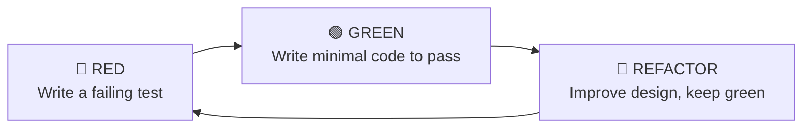
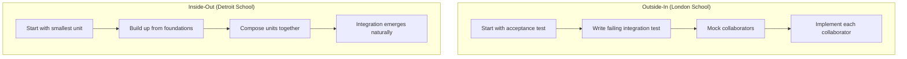
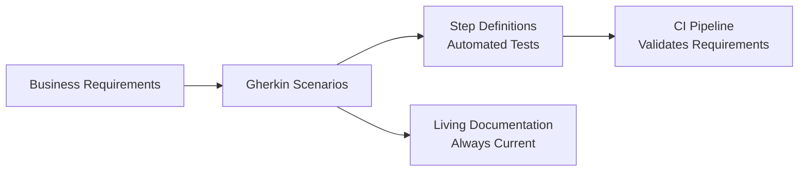

# TDD & BDD

Test-Driven Development (TDD) and Behaviour-Driven Development (BDD) are development *workflows* — not testing techniques. They change *when* and *how* you write tests, fundamentally altering your approach to design and implementation.

## Test-Driven Development (TDD)

### The Red-Green-Refactor Cycle



| Phase | What You Do | Rules |
|---|---|---|
| **Red** | Write a test that describes desired behaviour | Test must fail. If it passes, you haven't written the right test. |
| **Green** | Write the simplest code that makes the test pass | No more code than necessary. "Fake it 'til you make it." |
| **Refactor** | Improve code structure without changing behaviour | All tests stay green. Remove duplication. |

### TDD Example: Building a Password Validator

**Step 1 — Red:** Write the first test

```python
def test_password_must_be_at_least_8_characters():
    assert validate_password("short") == {
        "valid": False,
        "errors": ["Must be at least 8 characters"],
    }
```

Running this fails — `validate_password` doesn't exist yet.

**Step 2 — Green:** Minimal implementation

```python
def validate_password(password: str) -> dict:
    errors = []
    if len(password) < 8:
        errors.append("Must be at least 8 characters")
    return {"valid": len(errors) == 0, "errors": errors}
```

Test passes. ✅

**Step 3 — Red again:** Add next requirement

```python
def test_password_must_contain_uppercase():
    result = validate_password("alllowercase")
    assert "Must contain at least one uppercase letter" in result["errors"]

def test_valid_password():
    result = validate_password("SecurePass1!")
    assert result["valid"] is True
    assert result["errors"] == []
```

**Step 4 — Green:** Extend implementation

```python
def validate_password(password: str) -> dict:
    errors = []
    if len(password) < 8:
        errors.append("Must be at least 8 characters")
    if not any(c.isupper() for c in password):
        errors.append("Must contain at least one uppercase letter")
    return {"valid": len(errors) == 0, "errors": errors}
```

**Step 5 — Refactor:** Extract rule pattern

```python
PASSWORD_RULES = [
    (lambda p: len(p) >= 8, "Must be at least 8 characters"),
    (lambda p: any(c.isupper() for c in p), "Must contain at least one uppercase letter"),
    (lambda p: any(c.isdigit() for c in p), "Must contain at least one digit"),
]

def validate_password(password: str) -> dict:
    errors = [msg for check, msg in PASSWORD_RULES if not check(password)]
    return {"valid": len(errors) == 0, "errors": errors}
```

All tests still pass. Design improved. ✅

### When TDD Helps Most

| Scenario | Why TDD Works Well |
|---|---|
| **Pure logic** (parsers, validators, calculations) | Clear inputs and outputs, easy to define tests first |
| **Well-understood requirements** | You know what the code should do before writing it |
| **Refactoring legacy code** | Write tests around existing behaviour, then refactor safely |
| **Algorithm design** | Tests define expected output, you iterate toward solution |
| **API design** | Write the consumer first (test), then build the implementation |

### When TDD Is Less Effective

| Scenario | Why |
|---|---|
| **Exploratory prototyping** | Requirements are unknown — you're discovering what to build |
| **UI layout/styling** | Visual correctness can't be easily expressed in assertions |
| **Integration with unfamiliar APIs** | Need to experiment before knowing what to test |
| **One-off scripts** | Cost of TDD exceeds lifetime value of the tests |

## Outside-In vs Inside-Out TDD



| Approach | Starting Point | Mocking | Design Driver |
|---|---|---|---|
| **Outside-In** | User-facing behaviour | Heavy (mock collaborators) | Interfaces designed top-down |
| **Inside-Out** | Core domain logic | Minimal (real objects) | Design emerges bottom-up |

### Outside-In Example

```python
# Start with what the user sees
def test_checkout_creates_order_and_charges_payment():
    # This test drives the design of CheckoutService
    checkout = CheckoutService(
        payment_gateway=mock_gateway,
        order_repository=mock_repo,
    )
    result = checkout.execute(cart=cart, payment_method=card)
    assert result.success is True

# Then implement CheckoutService, which defines what it needs from collaborators
```

### Inside-Out Example

```python
# Start with core domain
def test_order_calculates_total():
    order = Order(items=[Item("Widget", 10), Item("Gadget", 20)])
    assert order.total == 30

# Then build up to the service layer
def test_checkout_service_uses_real_order():
    order = Order(items=[Item("Widget", 10)])
    service = CheckoutService(repo=InMemoryRepo(), gateway=FakeGateway())
    result = service.execute(order)
    assert result.success is True
```

## Behaviour-Driven Development (BDD)

BDD extends TDD by writing tests in natural language that stakeholders can read:

### Gherkin Syntax

```gherkin
Feature: Shopping Cart
  As a customer
  I want to manage items in my cart
  So that I can purchase what I need

  Scenario: Add item to empty cart
    Given I have an empty cart
    When I add a "Widget" priced at $9.99
    Then my cart should contain 1 item
    And the cart total should be $9.99

  Scenario: Apply discount code
    Given I have a cart with items totalling $50.00
    When I apply discount code "SAVE10"
    Then the cart total should be $45.00

  Scenario: Invalid discount code
    Given I have a cart with items totalling $50.00
    When I apply discount code "FAKE"
    Then I should see an error "Invalid discount code"
    And the cart total should remain $50.00
```

### Step Definitions (Python — behave)

```python
from behave import given, when, then

@given('I have an empty cart')
def step_empty_cart(context):
    context.cart = Cart()

@when('I add a "{item}" priced at ${price:f}')
def step_add_item(context, item, price):
    context.cart.add(Item(name=item, price=price))

@then('my cart should contain {count:d} item(s)')
def step_cart_count(context, count):
    assert len(context.cart.items) == count

@then('the cart total should be ${total:f}')
def step_cart_total(context, total):
    assert context.cart.total == total
```

### Step Definitions (JavaScript — Cucumber)

```javascript
import { Given, When, Then } from '@cucumber/cucumber';
import { expect } from 'chai';

Given('I have an empty cart', function () {
  this.cart = new Cart();
});

When('I add a {string} priced at ${float}', function (item, price) {
  this.cart.add({ name: item, price });
});

Then('my cart should contain {int} item(s)', function (count) {
  expect(this.cart.items).to.have.lengthOf(count);
});

Then('the cart total should be ${float}', function (total) {
  expect(this.cart.total).to.equal(total);
});
```

### Living Documentation

BDD scenarios serve as executable specifications:



| Benefit | How |
|---|---|
| **Shared understanding** | Product, dev, and QA agree on behaviour before coding |
| **Executable specs** | Scenarios run as automated tests |
| **Living documentation** | If tests pass, the documentation is accurate |
| **Regression detection** | Changed behaviour immediately breaks the scenario |

## BDD vs TDD

| Aspect | TDD | BDD |
|---|---|---|
| **Audience** | Developers | Developers + Product + QA |
| **Language** | Code (test framework) | Natural language (Gherkin) |
| **Scope** | Unit/function level | Feature/behaviour level |
| **Goal** | Drive code design | Drive feature understanding |
| **When to use** | Always (for code design) | When stakeholder alignment matters |

## Kata Exercises

Practice TDD with these classic exercises (increasing difficulty):

| Kata | Concepts Practiced |
|---|---|
| **FizzBuzz** | Basic TDD cycle, simple conditionals |
| **String Calculator** | Incremental design, parsing |
| **Roman Numerals** | Pattern recognition, refactoring |
| **Bowling Game** | State management, scoring rules |
| **Mars Rover** | Object design, command pattern |
| **Bank Account** | Time-dependent logic, formatting |
| **Game of Life** | Grid operations, neighbour logic |

### FizzBuzz Kata — TDD Walkthrough

```python
# Test 1: Regular number
def test_returns_number_as_string():
    assert fizzbuzz(1) == "1"

# Test 2: Divisible by 3
def test_returns_fizz_for_multiples_of_3():
    assert fizzbuzz(3) == "Fizz"
    assert fizzbuzz(6) == "Fizz"

# Test 3: Divisible by 5
def test_returns_buzz_for_multiples_of_5():
    assert fizzbuzz(5) == "Buzz"
    assert fizzbuzz(10) == "Buzz"

# Test 4: Divisible by both
def test_returns_fizzbuzz_for_multiples_of_15():
    assert fizzbuzz(15) == "FizzBuzz"
    assert fizzbuzz(30) == "FizzBuzz"
```

Write each test, watch it fail, implement the minimum, refactor if needed, repeat.

## Key Takeaways

- TDD is a design practice, not a testing practice — it produces tests as a by-product of good design
- The Red-Green-Refactor cycle forces you to think about requirements *before* implementation
- Outside-In TDD designs interfaces from the consumer's perspective; Inside-Out builds from domain logic up
- BDD bridges the gap between technical tests and business requirements using natural language
- Gherkin scenarios serve as living documentation that stays accurate as long as tests pass
- TDD works best for well-understood requirements and pure logic; skip it for exploratory prototyping
- Practice with katas — the discipline of TDD improves with repetition
