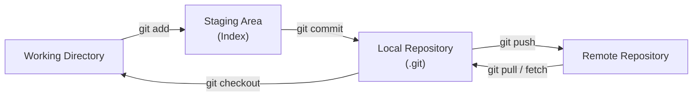
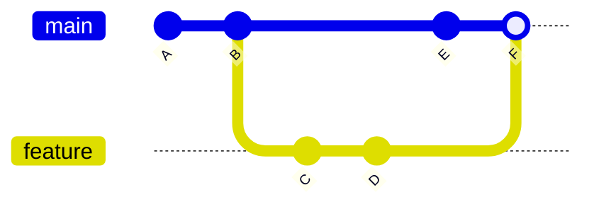

## What Is Git?

Git is a distributed version control system that tracks changes in source code. Created by Linus Torvalds in 2005 for Linux kernel development, it's now the universal standard for software collaboration.

### Why Git?

| Feature | Benefit |
|---------|---------|
| Distributed | Every clone is a full repository — work offline, no single point of failure |
| Branching | Create, merge, and delete branches instantly |
| Speed | Local operations (log, diff, commit) are near-instant |
| Integrity | Every object is checksummed with SHA-1/SHA-256 |
| Staging area | Fine-grained control over what goes into each commit |

---

## Core Concepts



### The Three States

Every file in a Git repository is in one of three states:

| State | Location | Meaning |
|-------|----------|---------|
| **Modified** | Working directory | Changed but not staged |
| **Staged** | Index (staging area) | Marked to go into the next commit |
| **Committed** | Local repository (.git) | Safely stored as a snapshot |

---

## Configuration

```bash
# Identity (required — used in every commit)
git config --global user.name "Your Name"
git config --global user.email "you@example.com"

# Editor
git config --global core.editor "vim"

# Default branch name
git config --global init.defaultBranch main

# Useful aliases
git config --global alias.st status
git config --global alias.co checkout
git config --global alias.br branch
git config --global alias.lg "log --oneline --graph --all"

# View all config
git config --list --show-origin
```

### Configuration Levels

| Level | Flag | File | Scope |
|-------|------|------|-------|
| System | `--system` | `/etc/gitconfig` | All users on machine |
| Global | `--global` | `~/.gitconfig` | Current user |
| Local | `--local` | `.git/config` | Current repository |

Local overrides global, global overrides system.

---

## Essential Commands

### Starting a Repository

```bash
# New repository
git init
git init my-project

# Clone existing
git clone https://github.com/user/repo.git
git clone git@github.com:user/repo.git      # SSH
git clone repo.git my-folder                  # Custom directory name
```

### Daily Workflow

```bash
# Check status
git status
git status -s              # Short format

# Stage changes
git add file.txt           # Specific file
git add src/               # Entire directory
git add -p                 # Interactive hunk staging
git add .                  # Everything (use with care)

# Commit
git commit -m "feat: add user authentication"
git commit -am "fix: typo"    # Stage tracked files + commit
git commit --amend             # Modify last commit (before push)

# View history
git log
git log --oneline --graph --all
git log -5                     # Last 5 commits
git log --author="Name"
git log --since="2024-01-01"
git log -- path/to/file        # History of specific file

# View changes
git diff                   # Unstaged changes
git diff --staged          # Staged changes
git diff main..feature     # Between branches
git diff HEAD~3..HEAD      # Last 3 commits
```

### Undoing Changes

```bash
# Discard unstaged changes
git checkout -- file.txt       # Old syntax
git restore file.txt           # New syntax (Git 2.23+)

# Unstage (keep changes in working directory)
git reset HEAD file.txt        # Old syntax
git restore --staged file.txt  # New syntax

# Undo last commit (keep changes)
git reset --soft HEAD~1

# Undo last commit (discard changes) ⚠️
git reset --hard HEAD~1

# Create a new commit that undoes a previous one (safe for shared history)
git revert abc1234
```

---

## Branching and Merging



### Branch Operations

```bash
# List branches
git branch             # Local
git branch -r          # Remote
git branch -a          # All

# Create and switch
git branch feature-x
git checkout feature-x
git checkout -b feature-x      # Create + switch (shorthand)
git switch -c feature-x        # New syntax (Git 2.23+)

# Delete
git branch -d feature-x       # Safe (only if merged)
git branch -D feature-x       # Force delete

# Rename
git branch -m old-name new-name
```

### Merging

```bash
# Merge feature into main
git checkout main
git merge feature-x

# Merge strategies
git merge --no-ff feature-x   # Always create merge commit
git merge --squash feature-x  # Squash all commits into one (no merge commit)
git merge --abort              # Abort a conflicted merge
```

### Conflict Resolution

When Git can't auto-merge, it marks conflicts in the file:

```
<<<<<<< HEAD
current branch content
=======
incoming branch content
>>>>>>> feature-x
```

Steps:
1. Edit the file to resolve (remove markers, keep desired content)
2. `git add resolved-file.txt`
3. `git commit`

---

## Rebasing

Rebase replays commits on top of another base — creates linear history:

```bash
# Rebase feature onto latest main
git checkout feature-x
git rebase main

# Interactive rebase (edit, squash, reorder commits)
git rebase -i HEAD~5
git rebase -i main

# Abort if things go wrong
git rebase --abort
```

### Interactive Rebase Commands

| Command | Effect |
|---------|--------|
| `pick` | Keep commit as-is |
| `reword` | Keep commit, edit message |
| `squash` | Merge into previous commit (combine messages) |
| `fixup` | Merge into previous commit (discard message) |
| `drop` | Delete commit |
| `edit` | Pause to amend the commit |

> **Golden rule:** Never rebase commits that have been pushed to a shared branch.

---

## Working with Remotes

```bash
# List remotes
git remote -v

# Add remote
git remote add origin git@github.com:user/repo.git
git remote add upstream git@github.com:original/repo.git

# Fetch (download without merging)
git fetch origin
git fetch --all

# Pull (fetch + merge)
git pull origin main
git pull --rebase origin main   # Fetch + rebase instead of merge

# Push
git push origin main
git push -u origin feature-x   # Set upstream tracking
git push --force-with-lease     # Safe force push (fails if remote has new commits)
```

---

## Stashing

Temporarily save uncommitted changes:

```bash
git stash                      # Stash tracked changes
git stash -u                   # Include untracked files
git stash save "WIP: login"    # With message

git stash list                 # View stash stack
git stash pop                  # Apply + remove latest
git stash apply stash@{2}     # Apply specific stash (keep in stack)
git stash drop stash@{0}      # Delete specific stash
git stash clear                # Delete all stashes
```

---

## Tags

```bash
# Lightweight tag
git tag v1.0.0

# Annotated tag (recommended — includes metadata)
git tag -a v1.0.0 -m "Release 1.0.0"

# Tag a specific commit
git tag -a v0.9.0 abc1234

# List tags
git tag
git tag -l "v1.*"

# Push tags
git push origin v1.0.0
git push origin --tags         # All tags

# Delete
git tag -d v1.0.0              # Local
git push origin --delete v1.0.0  # Remote
```

---

## Advanced Git

### Bisect (Find Bug-Introducing Commit)

```bash
git bisect start
git bisect bad                 # Current commit is broken
git bisect good abc1234        # Known good commit
# Git checks out a middle commit — test it, then:
git bisect good                # or git bisect bad
# Repeat until found
git bisect reset               # Return to original state
```

### Reflog (Undo Almost Anything)

```bash
git reflog                     # History of HEAD movements
git checkout HEAD@{5}          # Go back to state 5 moves ago
git reset --hard HEAD@{3}      # Reset to 3 moves ago
```

### Cherry-Pick

```bash
git cherry-pick abc1234        # Apply a specific commit to current branch
git cherry-pick abc..def       # Range of commits
```

### Worktrees (Multiple Working Directories)

```bash
git worktree add ../hotfix hotfix-branch
git worktree list
git worktree remove ../hotfix
```

---

## .gitignore

```bash
# Compiled output
*.class
*.o
dist/
build/

# Dependencies
node_modules/
vendor/
.venv/

# Environment & secrets
.env
*.pem
credentials.json

# OS files
.DS_Store
Thumbs.db

# IDE
.idea/
.vscode/
*.swp
```

### Patterns

| Pattern | Matches |
|---------|---------|
| `*.log` | All .log files |
| `build/` | Directory named build |
| `!important.log` | Exception — don't ignore this |
| `**/logs` | Directory named logs anywhere |
| `doc/*.txt` | Only .txt in doc/, not subdirs |
| `doc/**/*.txt` | .txt in doc/ and all subdirs |

---

## Key Takeaways

1. **Commit often, push regularly** — small, focused commits are easier to understand, review, and revert
2. **Write meaningful commit messages** — future you will thank present you
3. **Branch for everything** — branches are cheap; use them for features, fixes, experiments
4. **Never force-push shared branches** — use `--force-with-lease` if you absolutely must
5. **Learn `git reflog`** — it's your safety net for recovering from almost any mistake
6. **Use `.gitignore` from day one** — never commit secrets, build artifacts, or OS files
7. **Prefer rebase for local history, merge for shared history** — keeps the graph readable
