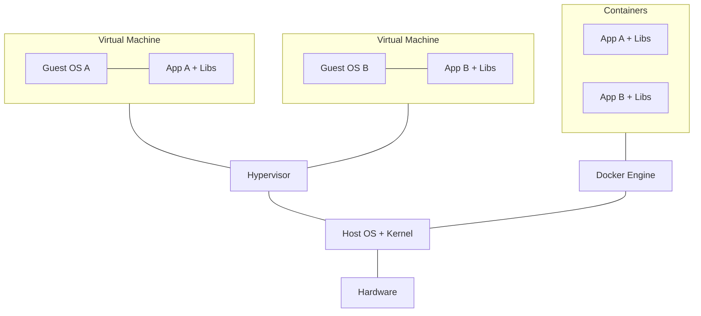

## What Is Docker?

Docker is a platform for building, running, and distributing applications inside **containers** — lightweight, isolated environments that package code with all its dependencies. Containers share the host OS kernel, making them far more efficient than virtual machines.



### Containers vs Virtual Machines

| Aspect | Container | Virtual Machine |
|--------|-----------|-----------------|
| Boot time | Seconds | Minutes |
| Size | MBs (app + libs only) | GBs (full OS) |
| Isolation | Process-level (shared kernel) | Full hardware-level |
| Performance | Near-native | Hypervisor overhead |
| Density | Hundreds per host | Tens per host |
| Use case | Microservices, CI/CD, dev environments | Full OS isolation, legacy apps |

---

## Core Concepts

| Concept | What It Is |
|---------|-----------|
| **Image** | Read-only template with app code, runtime, libraries, and config. Blueprint for containers. |
| **Container** | Running instance of an image. Isolated process with its own filesystem, networking, PID space. |
| **Dockerfile** | Text file with instructions to build an image layer by layer. |
| **Registry** | Storage for images (Docker Hub, ECR, GCR, GitLab Registry). |
| **Volume** | Persistent storage that survives container restarts/removal. |
| **Network** | Virtual network connecting containers. |

---

## Essential Commands

### Images

```bash
# Pull from registry
docker pull nginx:1.25
docker pull python:3.12-slim

# List local images
docker images
docker image ls

# Build from Dockerfile
docker build -t myapp:1.0 .
docker build -t myapp:latest -f Dockerfile.prod .

# Remove
docker rmi nginx:1.25
docker image prune          # Remove dangling images
docker image prune -a       # Remove all unused images
```

### Containers

```bash
# Run (create + start)
docker run nginx                          # Foreground
docker run -d nginx                       # Detached (background)
docker run -d -p 8080:80 nginx            # Map host:container port
docker run -d --name web -p 8080:80 nginx # Named container
docker run --rm alpine echo "hello"       # Remove after exit

# Interactive shell
docker run -it ubuntu bash
docker exec -it web bash                  # Shell into running container

# Lifecycle
docker start web
docker stop web
docker restart web
docker rm web                             # Remove stopped container
docker rm -f web                          # Force remove (running)

# Inspect
docker ps                                 # Running containers
docker ps -a                              # All (including stopped)
docker logs web                           # View logs
docker logs -f web                        # Follow logs
docker inspect web                        # Full JSON details
docker stats                              # Live resource usage
```

### Volumes

```bash
# Named volume (managed by Docker)
docker volume create mydata
docker run -d -v mydata:/app/data myapp

# Bind mount (host path)
docker run -d -v $(pwd)/src:/app/src myapp

# List and clean
docker volume ls
docker volume prune
```

---

## Dockerfile

### Anatomy

```dockerfile
# Base image
FROM python:3.12-slim

# Metadata
LABEL maintainer="you@example.com"

# Set working directory
WORKDIR /app

# Install dependencies (cached layer)
COPY requirements.txt .
RUN pip install --no-cache-dir -r requirements.txt

# Copy application code
COPY src/ ./src/

# Environment variables
ENV ENVIRONMENT=production
ENV PORT=8000

# Expose port (documentation)
EXPOSE 8000

# Non-root user (security)
RUN useradd -r appuser
USER appuser

# Default command
CMD ["python", "-m", "uvicorn", "src.main:app", "--host", "0.0.0.0", "--port", "8000"]
```

### Key Instructions

| Instruction | Purpose |
|-------------|---------|
| `FROM` | Base image (always first) |
| `WORKDIR` | Set working directory for subsequent instructions |
| `COPY` | Copy files from build context into image |
| `ADD` | Like COPY but can extract tarballs and fetch URLs |
| `RUN` | Execute command during build (creates layer) |
| `ENV` | Set environment variable |
| `EXPOSE` | Document which port the container listens on |
| `USER` | Switch to non-root user |
| `CMD` | Default command when container starts (overridable) |
| `ENTRYPOINT` | Fixed command (CMD becomes arguments) |
| `ARG` | Build-time variable (not available at runtime) |
| `VOLUME` | Declare mount point |
| `HEALTHCHECK` | Define health check command |

### Multi-Stage Builds

Produce small production images by separating build from runtime:

```dockerfile
# Stage 1: Build
FROM node:20 AS builder
WORKDIR /app
COPY package*.json ./
RUN npm ci
COPY . .
RUN npm run build

# Stage 2: Production (only the output)
FROM nginx:alpine
COPY --from=builder /app/dist /usr/share/nginx/html
EXPOSE 80
CMD ["nginx", "-g", "daemon off;"]
```

Result: final image has only Nginx + static files — no Node.js, no `node_modules`, no source code.

### Best Practices

| Practice | Why |
|----------|-----|
| Use specific base image tags (`python:3.12-slim`, not `python:latest`) | Reproducibility |
| Order instructions by change frequency (deps before code) | Layer caching |
| Combine `RUN` commands with `&&` | Fewer layers, smaller image |
| Use `.dockerignore` | Exclude unnecessary files from build context |
| Run as non-root `USER` | Security |
| Use multi-stage builds | Smaller production images |
| Add `HEALTHCHECK` | Orchestrators can detect unhealthy containers |

---

## Docker Networking

```bash
# Default networks
docker network ls

# Create custom network
docker network create mynet

# Run containers on same network (they can resolve each other by name)
docker run -d --name api --network mynet myapi
docker run -d --name db --network mynet postgres
# 'api' container can reach 'db' at hostname "db"
```

### Network Drivers

| Driver | Use Case |
|--------|----------|
| `bridge` | Default. Containers on same host communicate via virtual bridge |
| `host` | Container shares host's network stack (no isolation) |
| `none` | No networking |
| `overlay` | Multi-host networking (Docker Swarm) |

---

## Docker Compose

Docker Compose defines and runs **multi-container applications** using a YAML file. One command to start your entire stack.

### docker-compose.yml

```yaml
services:
  api:
    build: ./api
    ports:
      - "8000:8000"
    environment:
      - DATABASE_URL=postgres://user:pass@db:5432/myapp
      - REDIS_URL=redis://cache:6379
    depends_on:
      db:
        condition: service_healthy
      cache:
        condition: service_started
    volumes:
      - ./api/src:/app/src  # Dev: live reload
    restart: unless-stopped

  db:
    image: postgres:16-alpine
    environment:
      POSTGRES_USER: user
      POSTGRES_PASSWORD: pass
      POSTGRES_DB: myapp
    volumes:
      - pgdata:/var/lib/postgresql/data
    ports:
      - "5432:5432"
    healthcheck:
      test: ["CMD-SHELL", "pg_isready -U user -d myapp"]
      interval: 5s
      timeout: 3s
      retries: 5

  cache:
    image: redis:7-alpine
    ports:
      - "6379:6379"

  nginx:
    image: nginx:alpine
    ports:
      - "80:80"
    volumes:
      - ./nginx/nginx.conf:/etc/nginx/nginx.conf:ro
    depends_on:
      - api

volumes:
  pgdata:
```

### Compose Commands

```bash
# Start all services
docker compose up
docker compose up -d          # Detached

# Stop
docker compose down           # Stop and remove containers
docker compose down -v        # Also remove volumes

# Build / rebuild
docker compose build
docker compose up --build     # Rebuild before starting

# Scale
docker compose up -d --scale api=3

# Logs
docker compose logs
docker compose logs -f api    # Follow specific service

# Execute command in service
docker compose exec api bash

# Status
docker compose ps
```

### Compose Features

| Feature | Syntax | Use |
|---------|--------|-----|
| **depends_on** | `depends_on: [db]` | Startup order |
| **healthcheck** | `healthcheck: test: ...` | Wait until healthy before dependents start |
| **volumes** | Named or bind mounts | Persistent data, live code reload |
| **networks** | Custom networks | Isolate groups of services |
| **profiles** | `profiles: [debug]` | Optional services activated by flag |
| **env_file** | `env_file: .env` | Load environment from file |
| **restart** | `restart: unless-stopped` | Auto-restart policy |

### Environment Variables

```yaml
services:
  api:
    environment:
      - NODE_ENV=production      # Inline
    env_file:
      - .env                     # From file
      - .env.local               # Override (last wins)
```

---

## .dockerignore

```
.git
.gitignore
node_modules
dist
build
*.md
.env
.env.*
docker-compose*.yml
Dockerfile*
.dockerignore
__pycache__
*.pyc
.venv
.idea
.vscode
```

---

## Key Takeaways

1. **Images are immutable blueprints, containers are running instances** — think of it like classes vs objects
2. **Layer caching is crucial** — order Dockerfile instructions from least to most frequently changed
3. **Multi-stage builds** reduce production image size dramatically
4. **Run as non-root** — always add a `USER` instruction for security
5. **Docker Compose** is the standard for local multi-service development environments
6. **Use named volumes** for data that must persist (databases, uploads)
7. **Containers should be ephemeral** — design them to be stopped, destroyed, and rebuilt at any time
8. **One process per container** — don't run your app + database + Redis in one container
