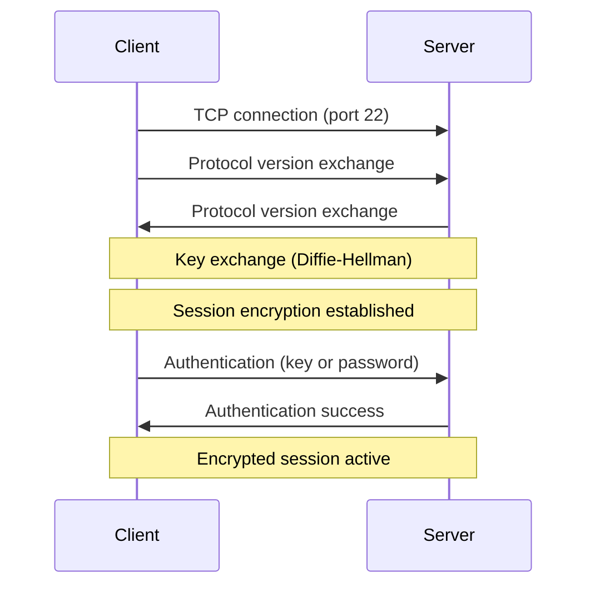

## What Is SSH?

**SSH (Secure Shell)** is a cryptographic network protocol for secure communication between computers over an unsecured network. It provides encrypted remote login, command execution, file transfer, and port forwarding.

SSH replaced insecure predecessors like Telnet, rlogin, and FTP — which transmitted everything (including passwords) in plaintext.

### What SSH Provides

| Feature | Description |
|---------|-------------|
| **Authentication** | Verify identity (password or key-based) |
| **Encryption** | All traffic encrypted in transit (AES, ChaCha20) |
| **Integrity** | Detect tampering (HMAC) |
| **Tunneling** | Forward ports, proxy traffic through encrypted channel |
| **File transfer** | SCP and SFTP for secure file operations |

---

## How SSH Works



### Authentication Methods

| Method | Security | Use Case |
|--------|----------|----------|
| **Public key** | Excellent | Default for servers, CI/CD, automation |
| **Password** | Moderate | Quick setup, less secure |
| **Certificate** | Excellent | Enterprise, large fleet management |
| **GSSAPI/Kerberos** | Excellent | Corporate environments with AD |

---

## Key-Based Authentication

### Generating Keys

```bash
# Ed25519 (recommended — fast, secure, short keys)
ssh-keygen -t ed25519 -C "you@example.com"

# RSA (legacy compatibility — use 4096 bits minimum)
ssh-keygen -t rsa -b 4096 -C "you@example.com"

# With custom filename
ssh-keygen -t ed25519 -f ~/.ssh/id_work -C "work laptop"
```

This creates two files:
- `~/.ssh/id_ed25519` — **Private key** (never share!)
- `~/.ssh/id_ed25519.pub` — **Public key** (safe to share)

### Installing Public Key on Server

```bash
# Method 1: ssh-copy-id (easiest)
ssh-copy-id user@server.example.com

# Method 2: Manual
cat ~/.ssh/id_ed25519.pub | ssh user@server "mkdir -p ~/.ssh && cat >> ~/.ssh/authorized_keys"

# Method 3: Copy-paste the content of id_ed25519.pub into ~/.ssh/authorized_keys on the server
```

### Permissions (Critical!)

SSH refuses to use keys with wrong permissions:

```bash
chmod 700 ~/.ssh
chmod 600 ~/.ssh/id_ed25519          # Private key
chmod 644 ~/.ssh/id_ed25519.pub      # Public key
chmod 600 ~/.ssh/authorized_keys     # On server
chmod 644 ~/.ssh/config              # Config file
```

---

## SSH Config File

The `~/.ssh/config` file lets you create aliases and default settings:

```bash
# Default for all hosts
Host *
    AddKeysToAgent yes
    IdentitiesOnly yes
    ServerAliveInterval 60
    ServerAliveCountMax 3

# Personal server
Host myserver
    HostName 192.168.1.100
    User admin
    Port 2222
    IdentityFile ~/.ssh/id_personal

# Work bastion/jump host
Host bastion
    HostName bastion.company.com
    User deployer
    IdentityFile ~/.ssh/id_work

# Server behind bastion (ProxyJump)
Host internal-db
    HostName 10.0.1.50
    User ubuntu
    ProxyJump bastion
    IdentityFile ~/.ssh/id_work

# GitHub
Host github.com
    IdentityFile ~/.ssh/id_github
    
# GitLab (custom port)
Host gitlab.company.com
    IdentityFile ~/.ssh/id_work
    Port 2222
```

Now you can simply:
```bash
ssh myserver          # Instead of: ssh -p 2222 admin@192.168.1.100 -i ~/.ssh/id_personal
ssh internal-db       # Automatically jumps through bastion
```

---

## Common SSH Commands

### Remote Login and Commands

```bash
# Basic login
ssh user@hostname
ssh user@hostname -p 2222          # Custom port

# Execute single command
ssh user@server "df -h"
ssh user@server "cat /var/log/syslog | tail -50"

# Execute with sudo (requires tty)
ssh -t user@server "sudo systemctl restart nginx"
```

### File Transfer

```bash
# SCP (simple copy)
scp file.txt user@server:/remote/path/
scp user@server:/remote/file.txt ./local/
scp -r folder/ user@server:/remote/         # Recursive

# SFTP (interactive)
sftp user@server
sftp> put localfile.txt
sftp> get remotefile.txt
sftp> ls
sftp> cd /var/www
sftp> exit

# rsync over SSH (best for large/incremental transfers)
rsync -avz -e ssh ./project/ user@server:/var/www/project/
rsync -avz --delete local/ user@server:remote/   # Mirror (delete extra files on remote)
```

---

## Port Forwarding (Tunneling)

### Local Port Forwarding

Access a remote service through your local machine:

```bash
# Forward local:8080 → remote-db:5432 through server
ssh -L 8080:remote-db:5432 user@server

# Now connect to localhost:8080 to reach remote-db:5432
psql -h localhost -p 8080 -U dbuser mydb
```


### Remote Port Forwarding

Expose a local service to the remote network:

```bash
# Make local:3000 accessible as server:9090
ssh -R 9090:localhost:3000 user@server
```

### Dynamic Port Forwarding (SOCKS Proxy)

```bash
# Create SOCKS5 proxy on local port 1080
ssh -D 1080 user@server

# Configure browser to use SOCKS5 proxy at localhost:1080
# All traffic routes through the SSH server
```

### Persistent Tunnels

```bash
# Background tunnel that stays alive
ssh -fN -L 8080:db:5432 user@server

# -f = background after auth
# -N = no remote command (tunnel only)
```

---

## SSH Agent

The SSH agent holds your private keys in memory so you don't have to enter the passphrase every time:

```bash
# Start agent (usually auto-started by OS)
eval "$(ssh-agent -s)"

# Add key
ssh-add ~/.ssh/id_ed25519
ssh-add -l                    # List loaded keys

# On macOS — persist in Keychain
ssh-add --apple-use-keychain ~/.ssh/id_ed25519
```

### Agent Forwarding

Use your local keys on a remote server (without copying them):

```bash
ssh -A user@bastion
# Now on bastion, you can SSH to other servers using your local keys
```

> **Security warning:** Only forward your agent to trusted servers. A compromised server could use your keys.

---

## Server-Side Configuration

### /etc/ssh/sshd_config (Key Settings)

```bash
# Disable password auth (key-only)
PasswordAuthentication no
PubkeyAuthentication yes

# Disable root login
PermitRootLogin no

# Change port (security through obscurity — not a real defense, but reduces noise)
Port 2222

# Limit users
AllowUsers deployer admin
AllowGroups ssh-users

# Idle timeout
ClientAliveInterval 300
ClientAliveCountMax 2

# Disable X11 forwarding (if not needed)
X11Forwarding no

# Restrict agent forwarding
AllowAgentForwarding no
```

After changes:
```bash
sudo sshd -t                          # Test config
sudo systemctl restart sshd           # Apply
```

---

## Troubleshooting

### Debug Connection

```bash
ssh -v user@server                    # Verbose
ssh -vv user@server                   # More verbose
ssh -vvv user@server                  # Maximum verbosity
```

### Common Issues

| Problem | Cause | Fix |
|---------|-------|-----|
| `Permission denied (publickey)` | Wrong key, wrong permissions, key not in authorized_keys | Check `ssh -v`, verify permissions (600/700) |
| `Connection refused` | SSH not running, wrong port, firewall | Verify `sshd` running, check port, check `ufw`/`iptables` |
| `Host key verification failed` | Server key changed (or MITM attack) | Remove old key: `ssh-keygen -R hostname` |
| `Connection timed out` | Network/firewall blocking port 22 | Check security groups, firewalls, routing |
| `Too many authentication failures` | Agent offering too many keys | Use `IdentitiesOnly yes` in config |

---

## Key Takeaways

1. **Always use key-based authentication** — disable password auth on servers
2. **Ed25519 keys** are the modern standard — shorter, faster, and more secure than RSA
3. **Use `~/.ssh/config`** — it saves typing and makes complex setups manageable
4. **Protect your private keys** — correct permissions (600), strong passphrases, never share
5. **SSH tunneling** solves many connectivity problems — access databases, bypass firewalls, create proxies
6. **Disable root login** and password auth on any internet-facing server
7. **Agent forwarding is convenient but risky** — only use with trusted servers
8. **`ssh -v` is your friend** — when connections fail, verbose mode shows exactly where it breaks
