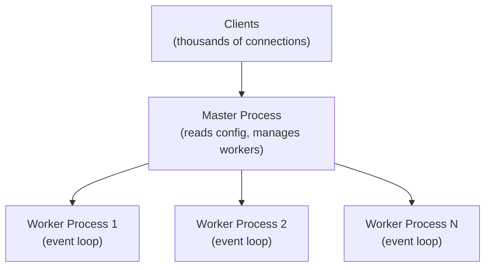

## What Is Nginx?

**Nginx** (pronounced "engine-x") is a high-performance web server, reverse proxy, and load balancer. Created by Igor Sysoev in 2004 to solve the C10K problem (handling 10,000+ concurrent connections), it uses an event-driven, asynchronous architecture that excels at serving static content and proxying to application backends.

### Architecture



Each worker process handles thousands of connections in a single thread using non-blocking I/O (epoll/kqueue). No thread-per-connection overhead.

---

## Installation

```bash
# Debian/Ubuntu
sudo apt update && sudo apt install nginx

# RHEL/CentOS/Amazon Linux
sudo yum install nginx        # or: sudo dnf install nginx

# macOS
brew install nginx

# Start and enable
sudo systemctl start nginx
sudo systemctl enable nginx

# Verify
nginx -v
curl http://localhost
```

---

## Directory Structure

```
/etc/nginx/
├── nginx.conf                # Main configuration
├── sites-available/          # Virtual host configs (Debian)
├── sites-enabled/            # Active vhosts (symlinks)
├── conf.d/                   # Additional configs (RHEL style)
├── snippets/                 # Reusable config fragments
├── mime.types                # MIME type mappings
└── modules-enabled/          # Dynamic modules

/var/www/html/                # Default document root
/var/log/nginx/               # Logs (access.log, error.log)
```

---

## Configuration Structure

Nginx config uses a hierarchical block structure:

```nginx
# Main context (global)
worker_processes auto;
error_log /var/log/nginx/error.log warn;
pid /run/nginx.pid;

events {
    worker_connections 1024;
    multi_accept on;
}

http {
    # HTTP context (applies to all servers)
    include /etc/nginx/mime.types;
    default_type application/octet-stream;
    
    sendfile on;
    keepalive_timeout 65;
    
    # Logging
    access_log /var/log/nginx/access.log;
    
    # Include server blocks
    include /etc/nginx/conf.d/*.conf;
    include /etc/nginx/sites-enabled/*;
}
```

### Contexts

| Context | Purpose |
|---------|---------|
| `main` | Global settings (worker processes, error log) |
| `events` | Connection handling parameters |
| `http` | HTTP server settings (shared across all servers) |
| `server` | Virtual host definition (one per domain) |
| `location` | URI matching and handling rules |
| `upstream` | Backend server pools for proxying |

---

## Server Blocks (Virtual Hosts)

### Basic Static Site

```nginx
server {
    listen 80;
    server_name mysite.com www.mysite.com;
    root /var/www/mysite;
    index index.html;
    
    location / {
        try_files $uri $uri/ =404;
    }
    
    # Cache static assets
    location ~* \.(css|js|png|jpg|jpeg|gif|ico|svg|woff2)$ {
        expires 30d;
        add_header Cache-Control "public, immutable";
    }
    
    # Deny hidden files
    location ~ /\. {
        deny all;
    }
}
```

### HTTPS with Let's Encrypt

```nginx
server {
    listen 443 ssl http2;
    server_name mysite.com;
    root /var/www/mysite;
    
    ssl_certificate /etc/letsencrypt/live/mysite.com/fullchain.pem;
    ssl_certificate_key /etc/letsencrypt/live/mysite.com/privkey.pem;
    
    # Modern TLS settings
    ssl_protocols TLSv1.2 TLSv1.3;
    ssl_ciphers ECDHE-ECDSA-AES128-GCM-SHA256:ECDHE-RSA-AES128-GCM-SHA256;
    ssl_prefer_server_ciphers off;
    
    # HSTS
    add_header Strict-Transport-Security "max-age=63072000; includeSubDomains" always;
    
    location / {
        try_files $uri $uri/ =404;
    }
}

# HTTP → HTTPS redirect
server {
    listen 80;
    server_name mysite.com www.mysite.com;
    return 301 https://mysite.com$request_uri;
}
```

---

## Location Blocks

### Matching Priority

| Modifier | Type | Priority | Example |
|----------|------|----------|---------|
| `=` | Exact match | 1 (highest) | `location = /favicon.ico` |
| `^~` | Prefix (stops regex search) | 2 | `location ^~ /static/` |
| `~` | Regex (case-sensitive) | 3 | `location ~ \.php$` |
| `~*` | Regex (case-insensitive) | 3 | `location ~* \.(jpg|png)$` |
| (none) | Prefix | 4 (lowest) | `location /api/` |

### Examples

```nginx
# Exact match — only /health
location = /health {
    return 200 "OK";
    add_header Content-Type text/plain;
}

# Prefix — anything under /static/
location /static/ {
    alias /var/www/assets/;
    expires 30d;
}

# Regex — PHP files
location ~ \.php$ {
    fastcgi_pass unix:/run/php/php8.2-fpm.sock;
    fastcgi_param SCRIPT_FILENAME $document_root$fastcgi_script_name;
    include fastcgi_params;
}

# API proxy
location /api/ {
    proxy_pass http://localhost:3000/;
    proxy_set_header Host $host;
    proxy_set_header X-Real-IP $remote_addr;
}
```

---

## Reverse Proxy

The most common Nginx use case — sit in front of application servers:

```nginx
server {
    listen 80;
    server_name app.example.com;
    
    location / {
        proxy_pass http://127.0.0.1:3000;
        
        # Forward client information
        proxy_set_header Host $host;
        proxy_set_header X-Real-IP $remote_addr;
        proxy_set_header X-Forwarded-For $proxy_add_x_forwarded_for;
        proxy_set_header X-Forwarded-Proto $scheme;
        
        # Timeouts
        proxy_connect_timeout 60s;
        proxy_send_timeout 60s;
        proxy_read_timeout 60s;
        
        # Buffering
        proxy_buffering on;
        proxy_buffer_size 4k;
        proxy_buffers 8 4k;
    }
    
    # WebSocket support
    location /ws/ {
        proxy_pass http://127.0.0.1:3000;
        proxy_http_version 1.1;
        proxy_set_header Upgrade $http_upgrade;
        proxy_set_header Connection "upgrade";
    }
}
```

---

## Load Balancing

```nginx
upstream backend {
    # Round-robin (default)
    server 127.0.0.1:3001;
    server 127.0.0.1:3002;
    server 127.0.0.1:3003;
    
    # Weighted
    server 127.0.0.1:3001 weight=3;
    server 127.0.0.1:3002 weight=1;
    
    # Backup (used only if others are down)
    server 127.0.0.1:3004 backup;
    
    # Health check params
    server 127.0.0.1:3001 max_fails=3 fail_timeout=30s;
}

# Load balancing methods:
# upstream backend { least_conn; ... }      # Least connections
# upstream backend { ip_hash; ... }         # Sticky sessions by IP
# upstream backend { hash $request_uri; }   # Consistent hashing

server {
    listen 80;
    location / {
        proxy_pass http://backend;
    }
}
```

---

## PHP with Nginx (PHP-FPM)

Unlike Apache, Nginx doesn't execute PHP directly — it proxies to PHP-FPM:

```nginx
server {
    listen 80;
    server_name myapp.com;
    root /var/www/myapp/public;
    index index.php index.html;
    
    location / {
        try_files $uri $uri/ /index.php?$query_string;
    }
    
    location ~ \.php$ {
        fastcgi_pass unix:/run/php/php8.2-fpm.sock;
        fastcgi_index index.php;
        fastcgi_param SCRIPT_FILENAME $realpath_root$fastcgi_script_name;
        include fastcgi_params;
    }
    
    # Deny access to dotfiles
    location ~ /\.(?!well-known) {
        deny all;
    }
}
```

---

## Performance Tuning

```nginx
# Worker processes (match CPU cores)
worker_processes auto;

events {
    worker_connections 4096;
    multi_accept on;
    use epoll;                  # Linux: efficient event notification
}

http {
    # File serving
    sendfile on;
    tcp_nopush on;
    tcp_nodelay on;
    
    # Buffers
    client_body_buffer_size 16k;
    client_max_body_size 50m;
    
    # Compression
    gzip on;
    gzip_vary on;
    gzip_min_length 1000;
    gzip_types text/plain text/css application/json application/javascript 
               text/xml application/xml text/javascript image/svg+xml;
    
    # Connection keep-alive
    keepalive_timeout 65;
    keepalive_requests 100;
    
    # Static file caching
    open_file_cache max=1000 inactive=20s;
    open_file_cache_valid 30s;
    open_file_cache_min_uses 2;
}
```

---

## Security

```nginx
# Hide Nginx version
server_tokens off;

# Security headers
add_header X-Content-Type-Options "nosniff" always;
add_header X-Frame-Options "DENY" always;
add_header X-XSS-Protection "1; mode=block" always;
add_header Referrer-Policy "strict-origin-when-cross-origin" always;
add_header Content-Security-Policy "default-src 'self'" always;

# Rate limiting
limit_req_zone $binary_remote_addr zone=api:10m rate=10r/s;

server {
    location /api/ {
        limit_req zone=api burst=20 nodelay;
        proxy_pass http://backend;
    }
}

# Block common exploits
location ~* (\.env|\.git|\.htaccess|\.htpasswd) {
    deny all;
}
```

---

## Management Commands

```bash
# Test configuration (always do this before reload!)
sudo nginx -t

# Reload (graceful — no dropped connections)
sudo systemctl reload nginx

# Restart (drops connections)
sudo systemctl restart nginx

# View active connections
sudo nginx -T | head -50       # Dump full effective config

# Log inspection
tail -f /var/log/nginx/access.log
tail -f /var/log/nginx/error.log
```

---

## Key Takeaways

1. **Nginx excels at concurrency** — event-driven architecture handles thousands of connections per worker
2. **Configuration is hierarchical** — directives inherit from parent contexts
3. **Location matching has strict priority** — exact > prefix-stop > regex > prefix
4. **Reverse proxy is the killer feature** — Nginx in front, application servers behind
5. **Always `nginx -t` before reload** — a syntax error in any config file stops the entire server
6. **Gzip and caching headers** are easy wins for performance
7. **Rate limiting** protects APIs from abuse with minimal config
8. **Use `try_files`** for SPAs and clean URLs — avoids unnecessary rewrites
