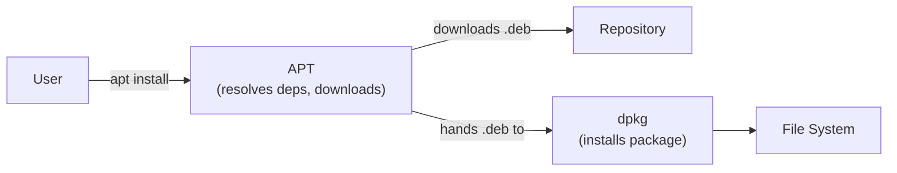

## What Is Package Management?

A package manager automates the process of installing, upgrading, configuring, and removing software. Instead of downloading binaries from websites and managing dependencies manually, you use a command-line tool that handles everything — fetching packages from repositories, resolving dependency trees, and tracking what's installed.

### Why Package Managers Matter

| Without | With |
|---------|------|
| Download from random websites | Install from trusted repositories |
| Manual dependency hunting | Automatic dependency resolution |
| No easy way to update all software | Single command to update everything |
| Unknown security status | Signed packages, vulnerability tracking |
| Difficult to reproduce environments | Scriptable, reproducible installs |

---

## Chocolatey (Windows)

Chocolatey is the leading package manager for Windows, bringing Linux-style package management to the Windows ecosystem.

### Installation

```powershell
# Run in elevated PowerShell (Admin)
Set-ExecutionPolicy Bypass -Scope Process -Force
[System.Net.ServicePointManager]::SecurityProtocol = [System.Net.ServicePointManager]::SecurityProtocol -bor 3072
iex ((New-Object System.Net.WebClient).DownloadString('https://community.chocolatey.org/install.ps1'))
```

### Essential Commands

```powershell
# Search for packages
choco search nodejs
choco search python --exact

# Install
choco install git -y
choco install nodejs python3 vscode -y        # Multiple packages
choco install firefox --version=120.0 -y      # Specific version

# Upgrade
choco upgrade git -y
choco upgrade all -y                          # Upgrade everything

# List installed
choco list

# Uninstall
choco uninstall nodejs -y

# Pin (prevent auto-upgrade)
choco pin add --name=python3
choco pin list
choco pin remove --name=python3

# Info about a package
choco info git
```

### Configuration

```powershell
# Enable auto-confirmation globally
choco feature enable -n=allowGlobalConfirmation

# Add custom repository source
choco source add --name=internal --source="https://packages.company.com/nuget"

# Disable default source (for enterprise)
choco source disable --name=chocolatey
```

### Common Packages

| Package | Install Command |
|---------|----------------|
| Git | `choco install git` |
| Node.js | `choco install nodejs` |
| Python | `choco install python3` |
| VS Code | `choco install vscode` |
| Docker Desktop | `choco install docker-desktop` |
| 7-Zip | `choco install 7zip` |
| curl | `choco install curl` |
| OpenSSH | `choco install openssh` |

---

## APT / DPKG (Debian, Ubuntu, Mint)

**APT** (Advanced Package Tool) is the high-level package manager for Debian-based systems. It wraps **dpkg**, the low-level tool that actually installs `.deb` packages.



### APT Commands

```bash
# Update package index (always do this first)
sudo apt update

# Upgrade installed packages
sudo apt upgrade                    # Safe upgrade (won't remove packages)
sudo apt full-upgrade               # May remove packages to resolve conflicts

# Search
apt search nginx
apt show nginx                      # Package details

# Install
sudo apt install nginx
sudo apt install nginx=1.24.0-1     # Specific version
sudo apt install ./package.deb      # Local .deb file
sudo apt install -y build-essential # Auto-confirm

# Remove
sudo apt remove nginx               # Remove package (keep config)
sudo apt purge nginx                 # Remove package + config
sudo apt autoremove                  # Remove orphaned dependencies

# List
apt list --installed
apt list --upgradable
dpkg -l | grep nginx                 # Low-level listing
```

### DPKG (Low-Level)

```bash
# Install .deb directly
sudo dpkg -i package.deb

# Fix broken dependencies after dpkg install
sudo apt install -f

# List files installed by a package
dpkg -L nginx

# Find which package owns a file
dpkg -S /usr/sbin/nginx

# Package info
dpkg -s nginx

# List installed packages
dpkg --get-selections | grep -v deinstall
```

### Repository Management

```bash
# Add repository
sudo add-apt-repository ppa:deadsnakes/ppa    # PPA (Ubuntu)
sudo apt update

# Manual repo (e.g., Docker)
curl -fsSL https://download.docker.com/linux/ubuntu/gpg | sudo gpg --dearmor -o /usr/share/keyrings/docker.gpg
echo "deb [signed-by=/usr/share/keyrings/docker.gpg] https://download.docker.com/linux/ubuntu $(lsb_release -cs) stable" | \
    sudo tee /etc/apt/sources.list.d/docker.list
sudo apt update

# List configured repos
cat /etc/apt/sources.list
ls /etc/apt/sources.list.d/
```

---

## DNF (Fedora, RHEL 8+, CentOS Stream, Rocky, Alma)

**DNF** (Dandified YUM) is the next-generation package manager for Red Hat-based systems, replacing YUM with better dependency resolution and performance.

### Commands

```bash
# Update package index + upgrade
sudo dnf check-update              # Check for updates (no install)
sudo dnf upgrade                   # Upgrade all packages
sudo dnf upgrade --security        # Security updates only

# Search
dnf search nodejs
dnf info nodejs

# Install
sudo dnf install nginx
sudo dnf install nginx-1.24.0      # Specific version
sudo dnf install ./package.rpm     # Local RPM
sudo dnf install @development      # Install group (dev tools)
sudo dnf groupinstall "Development Tools"

# Remove
sudo dnf remove nginx
sudo dnf autoremove                # Remove orphaned dependencies

# List
dnf list installed
dnf list available | grep python
dnf list --upgrades

# History (undo operations)
dnf history
sudo dnf history undo 15           # Undo transaction #15

# Provides (find which package has a file)
dnf provides /usr/bin/dig
dnf provides "*/bin/htop"
```

### Repository Management

```bash
# List repos
dnf repolist
dnf repolist all                   # Including disabled

# Add repo
sudo dnf config-manager --add-repo https://rpm.releases.hashicorp.com/fedora/hashicorp.repo

# Enable/disable
sudo dnf config-manager --set-enabled powertools   # RHEL/Rocky
sudo dnf config-manager --set-disabled testing

# EPEL (Extra Packages for Enterprise Linux)
sudo dnf install epel-release
```

### Modules (AppStreams)

DNF modules let you choose between multiple versions of software:

```bash
# List available modules
dnf module list
dnf module list nodejs

# Enable specific version stream
sudo dnf module enable nodejs:20
sudo dnf install nodejs

# Switch versions
sudo dnf module reset nodejs
sudo dnf module enable nodejs:18
sudo dnf install nodejs
```

---

## YUM (Amazon Linux, RHEL 7, CentOS 7)

**YUM** (Yellowdog Updater Modified) is the predecessor to DNF. Still used on Amazon Linux 2 and older RHEL/CentOS systems. Syntax is nearly identical to DNF.

### Commands

```bash
# Update
sudo yum check-update
sudo yum update                    # Upgrade all
sudo yum update nginx              # Upgrade specific package

# Search and info
yum search httpd
yum info httpd

# Install
sudo yum install httpd
sudo yum install httpd-2.4.6       # Specific version
sudo yum localinstall package.rpm  # Local RPM
sudo yum groupinstall "Development Tools"

# Remove
sudo yum remove httpd
sudo yum autoremove

# List
yum list installed
yum list available | grep python

# Find which package provides a file
yum provides /usr/bin/wget

# History
yum history
sudo yum history undo 12

# Clean cache
sudo yum clean all
sudo yum makecache
```

### Amazon Linux Specifics

```bash
# Amazon Linux 2 extras (topic-based packages)
amazon-linux-extras list
sudo amazon-linux-extras install docker
sudo amazon-linux-extras install python3.8

# Amazon Linux 2023 uses DNF
sudo dnf install httpd
```

### Repository Management

```bash
# List repos
yum repolist

# Add repo
sudo yum-config-manager --add-repo https://rpm.releases.hashicorp.com/AmazonLinux/hashicorp.repo

# Enable/disable
sudo yum-config-manager --enable epel
sudo yum-config-manager --disable testing

# Install EPEL
sudo yum install epel-release         # CentOS/RHEL
sudo amazon-linux-extras install epel  # Amazon Linux 2
```

---

## Homebrew (macOS and Linux)

**Homebrew** is the most popular package manager for macOS, also available on Linux. It installs software to its own directory and symlinks into standard paths.

### Installation

```bash
/bin/bash -c "$(curl -fsSL https://raw.githubusercontent.com/Homebrew/install/HEAD/install.sh)"
```

### Terminology

| Term | Meaning |
|------|---------|
| **Formula** | Package definition (command-line tools) |
| **Cask** | macOS GUI application (e.g., Firefox, VS Code) |
| **Tap** | Third-party repository of formulae |
| **Cellar** | Where Homebrew installs packages (`/opt/homebrew/Cellar/`) |
| **Keg** | Specific version of a formula in the Cellar |

### Commands

```bash
# Update Homebrew itself + package index
brew update

# Search
brew search node
brew search --cask firefox

# Install
brew install git
brew install node@20                   # Specific version
brew install --cask firefox            # GUI app
brew install --cask visual-studio-code

# Upgrade
brew upgrade                           # All formulae
brew upgrade git                       # Specific
brew upgrade --cask                    # All casks
brew upgrade --cask firefox

# List installed
brew list
brew list --cask
brew leaves                            # Top-level (not dependencies)

# Info
brew info git
brew info --cask firefox

# Uninstall
brew uninstall node
brew uninstall --cask firefox

# Cleanup (remove old versions)
brew cleanup
brew cleanup --prune=7                 # Remove downloads older than 7 days

# Diagnostics
brew doctor                            # Check for problems
brew config                            # Show configuration
```

### Services (Background Daemons)

```bash
# Start/stop services (replaces launchctl)
brew services list
brew services start postgresql@16
brew services stop redis
brew services restart nginx

# Run once (foreground, no auto-start)
brew services run postgresql@16
```

### Taps (Third-Party Repos)

```bash
# Add tap
brew tap hashicorp/tap
brew install hashicorp/tap/terraform

# Common taps
brew tap homebrew/cask-fonts           # Fonts
brew tap homebrew/cask-versions        # Beta/alternate versions

# List taps
brew tap
```

### Pinning (Prevent Upgrades)

```bash
brew pin node@20
brew unpin node@20
brew list --pinned
```

### Bundler (Brewfile)

Define all your packages in a `Brewfile` for reproducible setups:

```ruby
# Brewfile
tap "homebrew/cask"
tap "hashicorp/tap"

# CLI tools
brew "git"
brew "node@20"
brew "python@3.12"
brew "jq"
brew "ripgrep"
brew "terraform"

# GUI apps
cask "firefox"
cask "visual-studio-code"
cask "docker"
cask "iterm2"

# Fonts
cask "font-jetbrains-mono"
```

```bash
# Install everything from Brewfile
brew bundle

# Check what's missing
brew bundle check

# Clean up packages not in Brewfile
brew bundle cleanup
```

---

## Quick Reference

| Action | Chocolatey | APT | DNF | YUM | Homebrew |
|--------|-----------|-----|-----|-----|----------|
| Update index | — | `apt update` | `dnf check-update` | `yum check-update` | `brew update` |
| Upgrade all | `choco upgrade all` | `apt upgrade` | `dnf upgrade` | `yum update` | `brew upgrade` |
| Install | `choco install X` | `apt install X` | `dnf install X` | `yum install X` | `brew install X` |
| Remove | `choco uninstall X` | `apt remove X` | `dnf remove X` | `yum remove X` | `brew uninstall X` |
| Search | `choco search X` | `apt search X` | `dnf search X` | `yum search X` | `brew search X` |
| List installed | `choco list` | `apt list --installed` | `dnf list installed` | `yum list installed` | `brew list` |
| Info | `choco info X` | `apt show X` | `dnf info X` | `yum info X` | `brew info X` |
| Clean | — | `apt autoremove` | `dnf autoremove` | `yum autoremove` | `brew cleanup` |

---

## Key Takeaways

1. **Always update the index first** — `apt update`, `brew update`, `dnf check-update` before installing
2. **Use the system's native package manager** — it handles dependencies, updates, and security patches
3. **Pin critical packages** to prevent unintended upgrades in production
4. **Prefer repository packages over manual installs** — they get security updates automatically
5. **Use Brewfiles / package lists** to document and reproduce development environments
6. **DNF replaces YUM** — same commands, better performance and dependency resolution
7. **Chocolatey brings Linux-style management to Windows** — essential for automation and reproducibility
